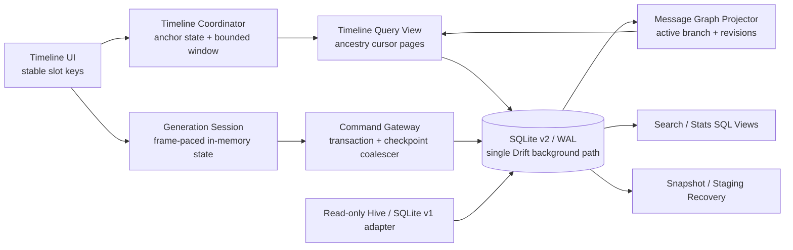
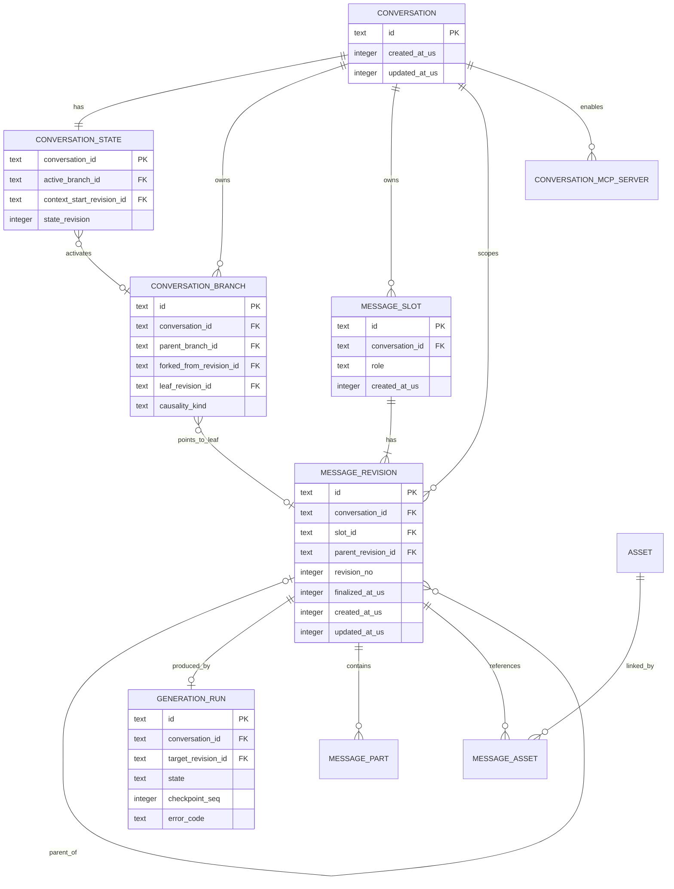
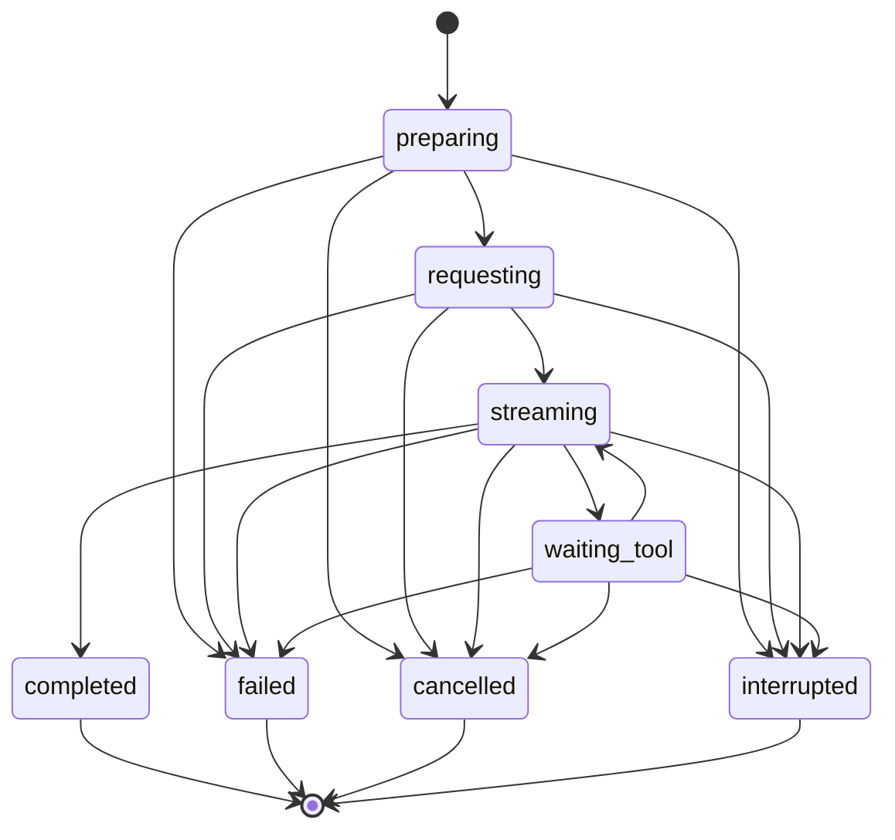
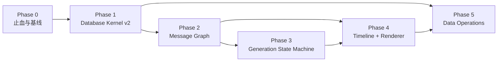

# Kelivo 聊天数据库与消息系统 v2 重构方案

> - 文档状态：设计基线；**PD-15（2026-07-12，用户裁决）已推翻 graph/branch 消息模型，最终形态为完全线性模型，见 §5.3 与 §11 Phase 6**。§6.3 的 graph 数据模型、§7.2 的 graft/fork 语义与 §7.4 的 timeline coordinator 设计保留为历史记录，不再是实施目标
> - 审计基线：分支 `sql`，提交 `df1dae8a`
> - 最后更新：2026-07-12
> - 实施状态：[chat-database-v2-refactoring-progress.md](./chat-database-v2-refactoring-progress.md)

## 1. 文档目的

本文档把现有 Hive → SQLite 改造审计转化为可实施、可验证、可回滚的重构方案。它是本次重构的稳定设计基线，负责说明：

- 为什么当前实现仍会发生数据风险、OOM、输出卡顿和列表跳动；
- 目标数据模型、模块边界和业务不变量；
- 发送、重生成、多版本、滚动、备份、恢复和异常退出的正确行为；
- 从历史 Hive、当前 SQLite v1 和旧备份迁移到 SQLite v2 的协议；
- 分阶段实施顺序、退出条件、性能目标和故障注入矩阵。

动态任务状态、决策结果、PR、验证命令和实测数据只记录在[进度文档](./chat-database-v2-refactoring-progress.md)，避免本方案被频繁状态更新淹没。

本文使用以下标记：

- **事实**：能由当前代码、测试、配置或 git 历史直接证明。
- **建议**：本方案推荐的目标实现，尚不代表已经完成。
- **待决策**：会改变数据模型或用户行为，不能由实现者自行猜测。

## 2. 执行合同

### 2.1 Primary Setpoint

建立一个以 SQLite/Drift 为唯一聊天数据源、以稳定消息因果图表达多版本、以有界时间线提供流畅交互、在进程崩溃和突然断电后仍保持业务一致性的聊天系统。

### 2.2 Acceptance

重构只有同时满足以下条件才可视为完成：

1. 所有聊天数据库访问均离开 UI isolate，不再存在同步 SQLite 旁路。
2. 每个持久状态转换都是原子的；长时间运行的发送/工具调用失败时留下完整、可恢复的 `failed`/`interrupted` 状态，而不是半状态或永久 loading。
3. 模型上下文只能来自当前分支的真实祖先，不能包含“未来消息”。
4. 版本选择引用稳定 revision ID，不再混用版本号和列表下标。
5. 打开会话、分页、流式输出和备份的内存占用受明确预算约束，不随数据库总量线性增长。
6. prepend、裁窗、版本切换、图片高度变化和窗口 resize 后，视觉锚点漂移满足性能 SLO。
7. 迁移和恢复通过 staging、完整性验证和可恢复切换完成；切换前失败不修改 live，切换中断时在开放业务访问前恢复为完整旧 bundle 或完整新 bundle。
8. 历史 Hive、SQLite v1、备份格式和五个平台均通过规定的兼容性与故障验证。

### 2.3 Guardrails

- 继续使用 SQLite/Drift，不因当前调用方式有问题而更换数据库。
- 禁止长期双写 Hive、SQLite v1 和 SQLite v2。
- 禁止以静默 fallback、吞异常、自动创建空库或假成功掩盖数据事故。
- 禁止为了测试暴露私有内部实现或扩大无关公共 API。
- 不在没有基准数据前加入 cache、mmap、线程池等“性能魔法参数”。
- 不手工修改 Drift、Hive 或本地化生成文件。
- 每个阶段保持可独立发布、可观测、可回滚，不做一次性大爆炸替换。

### 2.4 Boundary

本次范围包括：

- Hive 与当前 SQLite v1 聊天数据迁移；
- 会话、消息、多版本、分支、上下文截断、工具事件和 provider artifacts；
- 流式生成、失败、取消、异常退出和恢复；
- 消息列表分页、滚动锚点、长 Markdown、图片、表格和 Mermaid 缓存；
- 搜索、统计、附件引用、备份、恢复、导入和导出；
- SQLite schema、事务、WAL、完整性检查、跨平台文件切换；
- API key 等秘密与普通备份数据的边界。

不在本次范围内：

- 无关页面的视觉重设计；
- 模型供应商网络协议的整体重写；
- 与聊天数据无关的所有 SharedPreferences 一次性迁移；
- 没有需求依据的通用 ORM、事件总线或分布式同步框架。

## 3. 当前事实与根因

### 3.1 当前已经使用 SQLite，但仍保留 Hive 时代的对象图

当前 Drift schema 位于 [`app_database.dart`](../../lib/core/database/app_database.dart)，聊天主数据已写入 SQLite；但 `Conversation` 和 `ChatMessage` 仍保留 Hive model 形态，服务层仍大量依赖完整 `messageIds`、整会话加载、可变对象和永久缓存。

因此，当前改造主要完成了“存储介质替换”，尚未完成“数据访问模型和消息领域语义重构”。

### 3.2 已确认的高风险链路

| 级别 | 事实 | 直接影响 | 主要证据 |
| --- | --- | --- | --- |
| P0 | Drift 后台连接旁边又打开一个原生同步 SQLite 连接 | 分页、搜索、单条读取仍可阻塞 UI isolate | [`chat_database_repository.dart`](../../lib/core/database/chat_database_repository.dart#L11) |
| P0 | 每个流式 chunk 都暂停订阅、同步读整行、再 UPSERT 增长中的全文 | 网络背压、近似 O(n²) 写放大、输出越长越卡 | [`chat_actions.dart`](../../lib/features/home/controllers/chat_actions.dart#L293)、[`chat_service.dart`](../../lib/core/services/chat/chat_service.dart#L1073) |
| P0 | 新版本物理追加到会话尾部，重生成切点使用物理数组 index | 重生成旧回答时可能把后续未来轮次放入模型上下文 | [`chat_service.dart`](../../lib/core/services/chat/chat_service.dart#L1295)、[`message_generation_service.dart`](../../lib/features/home/services/message_generation_service.dart#L353) |
| P0 | `versionSelections` 同时被当作版本号与排序后数组下标 | 删除版本产生缺口后，UI、搜索和上下文可能选择不同 revision | [`chat_controller.dart`](../../lib/features/home/controllers/chat_controller.dart#L723)、[`home_view_model.dart`](../../lib/features/home/controllers/home_view_model.dart#L573) |
| P0 | 覆盖恢复先清空 live 数据，再逐会话写入；部分异常被吞 | 磁盘满、坏备份或中途退出可留下空库/半库并显示成功 | [`data_sync.dart`](../../lib/core/services/backup/data_sync.dart#L1027) |
| P0 | 迁移替换先删除正式 SQLite family，再逐个 rename 临时文件 | 删除与 rename 之间异常退出可能没有可启动的 live DB | [`hive_to_sqlite_migration_service.dart`](../../lib/features/migration/hive_to_sqlite_migration_service.dart#L1045) |
| P0 | 数据库缺失或损坏时可能直接创建新空库 | 真实数据事故被解释为“正常没有聊天记录” | [`chat_service.dart`](../../lib/core/services/chat/chat_service.dart#L46) |
| P1 | `MAX(message_order)+1` 与 insert 不在同一事务且没有唯一约束 | 并发和 merge restore 可产生重复顺序 | [`chat_database_repository.dart`](../../lib/core/database/chat_database_repository.dart#L458) |
| P1 | 360 条滑窗 prepend 后裁尾，却只按总高度净差补偿；append 裁头无补偿 | 长会话双向分页发生确定性跳动 | [`chat_controller.dart`](../../lib/features/home/controllers/chat_controller.dart#L204)、[`message_list_view.dart`](../../lib/features/home/widgets/message_list_view.dart#L450) |
| P1 | 窗口内出现版本组就同步加载该组全部 revision | 360 条限制不是真实内存上限，多版本长消息仍可 OOM | [`chat_controller.dart`](../../lib/features/home/controllers/chat_controller.dart#L767) |
| P1 | 备份、统计、摘要等继续整会话加载并永久缓存 | 大库操作把全库对象图常驻内存 | [`data_sync.dart`](../../lib/core/services/backup/data_sync.dart#L603)、[`stats_page.dart`](../../lib/features/stats/pages/stats_page.dart#L158) |
| P1 | SharedPreferences 备份可能包含 API key、代理密码和远端备份凭据 | 明文 ZIP 泄露即凭据泄露 | [`data_sync.dart`](../../lib/core/services/backup/data_sync.dart#L1680) |

### 3.3 多版本语义的确定性反例

现有物理顺序可能为：

```text
u1, a1-v0, u2, a2-v0, a1-v1
```

`a1-v1` 在 UI 中仍显示在第一轮 assistant 的逻辑位置，但它的物理 index 已在数组末尾。用户重生成 `a1-v1` 时，当前逻辑把 `lastKeep` 设为该末尾 index，于是 `u2` 和 `a2-v0` 会进入重生成第一轮回答的上下文。

这不是单个 if 判断错误，而是“展示顺序、因果顺序和物理存储顺序共用同一个数组”造成的结构性问题。

### 3.4 滚动锚点算法的确定性反例

设一次向前分页插入旧消息总高度为 `A`，同时为维持 360 条窗口裁掉尾部消息总高度为 `R`：

- 当前算法使用 `newMaxScrollExtent - oldMaxScrollExtent = A - R` 补偿；
- 原有可见消息实际被顶部新增内容推移了 `A`；
- 因此补偿必然少 `R`；当 `A <= R` 时甚至完全不补偿；
- 向后分页裁掉顶部高度时，当前实现没有相应的稳定项补偿。

可变高度 Markdown、图片异步解码、reasoning 展开和版本切换会继续放大这种偏差。

## 4. 领域不变量

下列规则必须由 schema、事务和测试共同强制，不能仅依赖 UI 约定：

1. **数据存在性**：既有安装的数据库缺失、损坏或身份不匹配时，应用必须进入恢复/诊断流程，不得静默创建空库。
2. **状态转换原子性**：每个持久 transition 只能得到完整前态或完整后态；远程生成不是一个长数据库事务，失败必须落为完整的失败/中断状态。
3. **因果路径**：当前模型上下文只能包含 active branch 上目标 revision 的祖先。
4. **稳定引用**：版本选择、上下文边界、分页 cursor 和 UI key 均引用稳定 ID，不引用数组下标。
5. **版本唯一性**：同一 slot 内 `revision_no` 唯一但允许有缺口；任何业务逻辑不得依赖编号连续。
6. **终态单向**：`completed`、`failed`、`cancelled`、`interrupted` 不得被迟到 chunk 改回 streaming。
7. **有界工作集**：UI 窗口、cache、图片、Markdown AST 和备份内存均有数量与字节预算。
8. **失败可见**：数据库、迁移、备份和恢复错误必须保留可定位信息并向调用者传播，不得返回假成功。
9. **秘密隔离**：普通备份默认不包含 API key、密码、session token 或系统安全存储内容。
10. **确定性排序**：时间字段使用 UTC 微秒，所有排序都带稳定唯一 tiebreaker。
11. **同库一致性**：parent、slot、revision、branch 和 selection 必须属于同一 conversation，并由包含 `conversation_id` 的复合 FK/UNIQUE 强制。
12. **可审计迁移**：无法无歧义修复的数据进入 recovered/rejects 记录并提示，不得静默丢弃或猜测。
13. **路径唯一性**：同一 active branch ancestry 中，一个 slot 最多出现一个 revision。

## 5. 必须先确定的产品决策

以下决定会改变 schema、迁移和用户交互。默认建议可用于原型，但进入消息图实现前必须正式确认。

> 2026-07-10：PD-01～PD-13 已全部完成决策，最终结论见 §5.1 与进度文档决策登记。下表保留原始问题与推荐值作为决策依据存档。

| ID | 待决策问题 | 推荐默认值 | 阻塞阶段 |
| --- | --- | --- | --- |
| PD-01 | 多版本采用真实分支，还是切换旧版本后仍无条件保留未来对话 | 真实分支；旧未来保留在旧 branch | Phase 2 |
| PD-02 | 编辑 user、重生成 assistant、删除 revision 后如何处理后代 | 创建/切换 branch，不物理删除旧后代；显式操作再 GC | Phase 2 |
| PD-03 | 中断输出如何展示，是否允许继续 | 保留 partial content，显示 `interrupted`，提供重试/删除 | Phase 3 |
| PD-04 | 用户在历史位置发送时的行为 | 从该位置创建新 branch，并保持该位置锚点直到首个新响应可见 | Phase 2/4 |
| PD-05 | 用户离开底部时，新内容如何提示 | 不强制跳动；显示“有新内容”，用户主动恢复 following tail | Phase 4 |
| PD-06 | 搜索范围 | 默认当前可见 branch，可显式搜索所有 revisions | Phase 5 |
| PD-07 | 统计范围 | 默认当前 active branch，另列全部生成消耗 | Phase 5 |
| PD-08 | 备份是否包含失败/中断 revision 和全部 branch | 完整备份包含；便携导出允许显式裁剪 | Phase 5 |
| PD-09 | restore merge 遇到相同 ID 如何处理 | 内容 hash 相同去重；不同则重新映射 ID 并记录冲突 | Phase 0/5 |
| PD-10 | 旧数据库保留期和清理授权 | 至少一次成功启动 + 明确保留周期，清理前可导出诊断信息 | Phase 1/5 |
| PD-11 | 聊天数据库是否需要应用层加密 | 单独安全评估；秘密必须立即移出明文普通备份 | Phase 0/5 |
| PD-12 | 损坏数据的恢复体验 | 只读恢复页，可导出 rejects/诊断包，用户决定继续或回滚 | Phase 1/5 |
| PD-13 | SQLite v1 是否已经发布给真实用户 | 以发布事实确认；若已发布，v1 必须是迁移主源 | Phase 0 |

### 5.1 PD-01～PD-13 最终决策（2026-07-10 冻结）

以下决策已确认为本次重构的产品语义基线。后续若要更改，必须先修订本节并评估 schema/迁移影响。

- **PD-01（2026-07-12 修订）：schema 保留真实分支，默认产品语义为"同 slot 版本 + 保留后代"。** 用户真机反馈证明纯 ChatGPT fork 语义与 Kelivo 既有产品合同冲突："仅保存"编辑 user 消息、默认关闭的"重新生成时删除下面的消息"开关都要求变更某个 slot 的内容后**下方对话原样保留**。因此：
  - 默认变更（"仅保存"、"保存并发送"、`regenerateDeleteTrailingMessages=false` 的重生成、版本切换）在同一 slot 创建/选择 sibling revision，并把该 slot 在 active path 上的直接 child re-parent 到新选中 revision（graft），branch 与下方所有 slot 不变；UI 仍用 `< n/m >` 版本分页控件表达同 slot 的 siblings。
  - 只有 `regenerateDeleteTrailingMessages=true` 的重生成与显式"截断到此处"操作才走 fork：创建截止于新 revision 的新 branch，旧后续对话完整保留在旧 branch。
  - 两种语义下，生成 prompt 的上下文都只来自目标 slot 的真实祖先（graft 的 descendants 不进入该次生成的 prompt），原不变量 3 不受影响。
  - graft 会改写共享路径段上其它 branch 看到的该 slot 内容，这与旧版"版本切换作用于整个会话"的语义一致，属预期行为并记录于此。
- **PD-02（2026-07-12 修订）：不物理删除旧后代。** 默认（graft）语义下旧 revision 作为同 slot sibling 保留，随时可 graft-select 切回；fork 语义下旧后续保留在旧 branch。删除是显式操作：删除单个 revision 时，若它是当前选中版本则自动 graft-select 到同 slot 最新剩余 revision；删除 slot 最后一个 revision 前必须提示将一并移除依赖它的后代段。物理 GC 延迟、批量执行并留审计记录。
- **PD-03：中断保留 partial，不做"继续生成"。** 用户取消、断网或崩溃恢复后的输出保留 partial content，气泡显示"已中断"标识，提供"重新生成"（同 slot 新 revision）和"删除"。partial 被后续轮次引用时按原样纳入上下文并保持标注（与 Claude 行为一致）。"继续生成"依赖 provider 侧不可靠的续写语义，列为 v2 之后的评估项，不进入本次范围。
- **PD-04：发送永远追加到 active branch leaf。** 用户在历史位置阅读时发送，执行一次 programmatic jump，把新 user 消息定位到 viewport 顶部附近（而不是贴底），assistant 回答随后向下流入，保证新一轮从头可读。编辑历史 user 消息走 PD-02 分支语义，该消息保持原 viewport 锚定，直到新回答首帧可见。
- **PD-05：绝不违背用户意图移动 viewport。** 滚动离开底部、选择文本、使用键盘、打开链接、触发搜索都视为阅读信号，立即退出 followingTail；流式内容在屏外继续，不改变用户所见位置；复用右侧既有“到底”导航按钮恢复尾随，不新增重复胶囊。会话重新打开时定位到最后一条 user 消息顶部，而非绝对底部。
- **PD-06：搜索默认只搜当前 active branch**（会话内与全局搜索一致），提供显式"包含所有版本/分支"开关。每个结果携带 branch/revision identity，跳转时切换到对应 branch 并按 slot 锚定。
- **PD-07：统计默认展示 active branch 口径**（用户实际看到的对话消耗），同页另列"全部生成消耗"（所有 revisions/branches 的 token/费用），两个口径都注明定义，不混用。**（已被 PD-16 第 3 条取代：统计页回单口径，按全部消息行计，与 `f7e11373` 一致。）**
- **PD-08：完整备份包含全部数据。** 应用默认完整备份包含全部 branch、全部 revision（含 failed/interrupted partial）与 generation run 元数据。便携 NDJSON 导出默认仅 active branch + completed revision，提供"包含全部"选项。
- **PD-09：merge 冲突按 hash 去重 + remap。** 同 ID 且内容 hash 相同的实体去重跳过；同 ID 内容不同时对导入侧整会话 remap 新 ID，生成用户可见的冲突报告；绝不静默覆盖 live 数据。
- **PD-10：旧 Hive 数据由用户主动清理。** 成功迁移后，只要冻结清单内的 Hive 文件仍存在，存储空间展示“聊天记录（旧）”及占用；用户可立即清理，清理后项目消失。删除仍写 crash-resumable retirement receipt，但不再要求 30 天、3 次冷启动、诊断导出或 rollout 授权。`.previous` 恢复证据的保留策略与此独立。
- **PD-11：v2 不引入应用层数据库加密，也不拆分平台安全存储。** API key、代理密码、WebDAV/S3/TTS/搜索等配置继续由 SharedPreferences 管理并随正常备份恢复；manifest 必须如实声明包含凭据。SQLCipher 等数据库/备份加密列为 v2 之后的独立评估，不阻塞本次重构。
- **PD-12：损坏数据进入只读恢复页。** 展示诊断摘要，可导出脱敏诊断包与 rejects，可选择"从备份恢复"或显式确认"以恢复出的数据继续"；绝不静默创建空库。
- **PD-13：SQLite v1 从未发布（已核实）。** 2026-07-10 以 git 证据确认：全部已发布 tag（≤ `v1.1.17`）、`origin/master` 与 `origin/beta` 均不含 drift/sqlite 依赖，SQLite v1 仅存在于未发布的 `sql`/`hive2sql`/`sqlite` 开发分支。因此：
  - 已发布用户的唯一数据源是 Hive，公开迁移主路径为 **Hive → v2**；
  - v2 是公开用户见到的第一个 SQLite schema，**不再向用户发布 v1**；
  - SQLite v1 → v2 仅作为开发机数据的尽力迁移路径（开发机也可从保留的 Hive 数据重迁移），不承担已发布数据级别的完整验证矩阵；
  - §9.1、§10 中"v1 为迁移主源"的条件分支按此关闭。

### 5.2 已冻结的补充决策

- **PD-14（2026-07-09，用户确认）**：应用正常的完整备份以 SQLite 一致快照为聊天主数据，ZIP 内不再生成 `chats.json`。ZIP 同时携带格式 manifest、非秘密 settings snapshot 和选中的 assets。
- 正常备份 manifest 使用 `secretsIncluded: true`：Provider API key、代理密码、WebDAV/S3/TTS/搜索等凭据随 settings 一起导出并可恢复，满足完整换机/灾备语义。备份 ZIP 因而属于敏感文件，产品文案不得宣称其无秘密。
- overwrite 恢复备份内的凭据；merge 应用来源中存在的凭据并保留来源未涉及的本机键。仍可读取历史 `secretsIncluded: false` bundle，其无秘密合并规则只作为备份格式兼容，不代表当前导出策略。
- 旧 `chats.json`/ZIP 必须继续通过只读 legacy adapter 导入；它不是新备份的写出格式。
- 旧 JSON 导入和 Hive → SQLite 迁移页灾难备份继续保持历史设置语义，因而可能包含明文凭据；它们不经过正常备份 sanitizer。该历史路径允许比新格式慢，但仍应使用流式 ZIP/文件写入、分批扫描和有界中间对象，尽力避免 OOM 与长时间阻塞。
- NDJSON/chunk 仅用于显式便携导出或 legacy/v2 数据转换，不作为应用默认完整备份格式。

### 5.3 PD-15：回归完全线性消息模型（2026-07-12，用户裁决，最高优先级）

用户在真机使用 graph/branch 版本后裁决：**该模型与 Kelivo 既有产品行为冲突且引入了大量原本不存在的 bug（仅保存、重生成等行为均不正常），放弃 ChatGPT 式 graph/branch 设计，回归重构前（`f7e11373` 基线）的完全线性模型。** 本决策取代 PD-01、PD-02 的 graph/graft/fork 语义，并收窄 PD-04/05/06/07 中与 branch 相关的部分。参考实现：rikkahub（Room/SQLite，线性节点列表 + 节点内版本数组 + selectIndex，与 Kelivo 旧模型同构），其成熟度佐证线性模型足以支撑同类产品全部功能。

**数据模型（最终形态）**：

- `message_rows` 是唯一消息真相：按 `message_order` 排序的线性列表；多版本 = 同 `group_id` 下的多行（`version` 递增）；`conversation_rows.version_selections_json` 记录每组选中版本（缺省为最新）。该结构在 v2 期间一直作为影子完整维护，回归即"扶正"，不需要数据搬迁。
- **删除** graph 四表（`message_slot_rows`、`message_revision_rows`、`conversation_branch_rows`、`conversation_state_rows`）及其命令/投影器/legacy adapter。v2 从未发布（PD-13：公开数据源是 Hive），删除无兼容负担。
- 保留 `message_part_rows`（ordered parts 读写）与 `generation_run_rows`（崩溃恢复），它们与线性/graph 无关。

**行为合同（恢复 `f7e11373` 基线行为，rikkahub 行为一致处已注明）**：

1. **仅保存（编辑 user/assistant 消息）**：组内追加新版本并选中；不删除任何消息、不触发重发、不改变列表其它位置。（rikkahub `editMessage` 同）
2. **重生成 assistant**：组内追加新版本并选中；`regenerateDeleteTrailingMessages=true` 时物理删除该组之后的消息，false（默认）时全部保留。（rikkahub assistant 重生成保留后续节点，同默认行为）
3. **重发 user 消息**：保持 `f7e11373` 基线行为（与重生成共用 `regenerateAtMessage` 入口）。
4. **版本切换**：只改该组的 `versionSelections`，渲染层换显示的行，下方消息不受影响。切换器 `< n/m >` 的 n/m 来自组内行数（一条 `GROUP BY group_id` 聚合查询，不依赖全量加载）。
5. **删除**：删单个版本 = 删该行，组内还有版本则选中合法的相邻版本；删组内最后一个版本 = 该组从列表消失；均不级联删除下方消息。（rikkahub 同）
6. **发送**：追加到列表尾部 + **滚动到底部**。**彻底移除"把用户消息推到视口顶部"的 programmatic jump/spacer 机制**（PD-04 中该部分作废）。（rikkahub 同：发送后 `requestScrollToItem` 到底）
7. **自动跟随**：仅当"正在生成 + 用户当前在底部 + 用户未在滚动"时贴底跟随；用户向上滚动立即脱离；右侧既有"到底"按钮恢复跟随。（rikkahub 同此三条件）
8. **跳转**（搜索/迷你地图/引用）：按 `message_order` 定位目标索引，必要时先加载到目标可见，再用 observer 按索引滚动；无 spacer、无 viewport 模式机。
9. **上下文**：`truncateIndex`/context divider 语义照旧作用于线性列表。

**保留的 v2 成果（与线性/graph 正交，不回退）**：Drift/SQLite 内核与安装门（Phase 1）、latest-wins 流式节流写库与崩溃恢复（P0-03/04、Phase 3 的 generation run，需改接线性写路径）、crash-safe 备份/恢复/合并（OPS-01/02/03）、FTS 搜索与 SQL 统计（OPS-04/05，需去掉 branch 口径）、附件引用/延迟 GC（OPS-06）、完整设置与凭据备份（OPS-07）、灰度能力与用户主动旧数据清理（OPS-08/09）。

**明确拆除**：graph 三层（schema/commands/projector）、TimelineCoordinator 的 ancestry cursor 窗口与 viewport 状态机、programmaticJump/spacer/visual anchor 协调器、graft/fork 语义、`backfillMissingMessageGraphs`、搜索/统计/NDJSON 的 active-branch 口径（改为"选中版本 / 全部版本"口径）。

### 5.4 PD-16：备份恢复与恢复页交互回归原产品（2026-07-13，用户裁决）

Phase 6 之后用户对遗留的产品行为偏差做出裁决，原则与 PD-15 一致：**用户可见交互以 `f7e11373` 基线为准，v2 的崩溃安全内核保留但不得改变产品交互**。同时明确：未发布的中间实现（如已回退的 secure-storage 拆分）不需要任何迁移兼容，兼容目标只有两个——最终形态与上一个已发布的 Hive 版本。

1. **任何备份导入完成后都弹"需要重启"对话框**（本地/WebDAV/S3、overwrite 与 merge 一律相同）。merge 完成后当前以 toast 结束是缺陷：merge 写入 SharedPreferences 的设置在重启前不生效，聊天合并结果也需重启后统一重载。合并报告改为并入重启对话框内容展示（参照基线 Cherry 导入完成对话框的样式），不再用 toast。
2. **前后台切换/引擎重建绝不进入恢复失败页。** 业务租约的同进程 owner marker（`owner_<pid>` 与当前 PID 相同）在**所有构建模式**下直接回收，不再限定 debug：OS 排它锁才是跨进程权威判据，同 isolate 重复获取由进程内 registry 拦截，Android 引擎重建与 Flutter 热重启同属"同进程新 isolate"场景。恢复失败页只保留给真实障碍：数据库损坏/身份不符、OS 锁被另一个活动进程持有（桌面双开）、receipt 无法收敛。
3. **统计页恢复单口径展示。** 指标格回到单值，口径与 `f7e11373` 相同：按全部消息行（含所有版本）计数/计 token；heatmap/trend/rank 同口径。删除"选中版本 / 全部生成"双值并列展示及相关 l10n；SQL 聚合下推的性能成果保留，仅统计口径与展示收敛。PD-07 的双口径设计作废。
4. **恢复痕迹改为用户可清理。** `.kelivo_restore/completed/run_*` 归档（含恢复前旧数据库/设置/附件快照）仅用于人工回滚与诊断，恢复提交后删除不影响运行。存储空间新增"恢复痕迹"清理项，交互与"聊天记录（旧）"一致：有终态归档时显示占用与清理按钮，清理后消失。活动/未终态 run 不显示为可清理、绝不删除；工作区锁与在途恢复保持 fail-closed。

### 5.5 PD-17：启动与大会话性能回归 + 数据库改名（2026-07-13，用户裁决）

用户实测：数据库 3GB 以上、或单会话内容 1GB 以上时，冷启动黑屏极久、进入/使用大会话明显卡顿。根因诊断与裁决如下。参照对象 rikkahub（Room 直接 open）与 cherry-studio（better-sqlite3 直接 open）在启动路径上均为**零全库扫描**，崩溃恢复完全依赖 SQLite WAL 自身语义。

**根因 A——启动黑屏与库大小成正比。** 移动端进程几乎从不干净退出（OS 直接杀进程，`ChatDatabaseGateway` 的 `endSession` 无机会执行），`.database_session_receipt.json` 因此几乎每次冷启动都残留；`DatabaseInstallationGate.ensureReady` 在 `runApp` 之前、主 isolate 上同步执行 `_recoverUncleanSession` → `PRAGMA quick_check` + `PRAGMA foreign_key_check`，需要读完整个数据库文件。schema 升级时 `migrateInstalledDatabase` 更是在迁移前后各做一次全库 `integrity_check` + `foreign_key_check`。

**根因 B——大会话全量加载。** 消息列表窗口化本身正确，但：发送/重新生成每次经 `messagesForCompleteHistoryContext` → `ChatService.loadMessages` 全量加载整个会话内容（且单次发送内调用两次）；迷你地图、全选、导出选中同样全量；`_messagesCache` 无容量上限、不驱逐，1GB 会话进内存后常驻。

裁决（原则：正常启动零全库扫描，全库校验只出现在显式恢复/诊断/快照路径；上下文与工具路径按需限量读取）：

1. **废除会话收据机制及其全库检查。** 删除 `.database_session_receipt.json` 的写入/校验/`_recoverUncleanSession`；崩溃后恢复交给 SQLite WAL（这正是 WAL 的设计用途）。安装门正常路径只保留 O(1) 工作：`user_version` 读取、meta 表身份读取、receipt 匹配、`_validateRawStructure`（表结构 `table_info`，与数据量无关）。`quick_check`/`integrity_check`/`foreign_key_check` 仅保留在：恢复失败页诊断、备份快照制备与导入校验（`_validateRawSnapshot` 用于快照的语义不变）、显式人工诊断入口。
2. **schema 迁移不再做前后全库校验。** `migrateInstalledDatabase` 去掉迁移前 `_validateRawSnapshot` 与迁移后 `validateContents: true` 复查，改为结构校验 + 迁移事务原子性兜底（drift 迁移失败即回滚、门 fail-closed）。迁移属一次性操作，可接受的上限是秒级，不是分钟级黑屏。
3. **上下文构建限量读取。** 发送/重新生成的 API 上下文不再全量 `loadMessages`：按 `truncateIndex` 与助手上下文上限从 DB 只取尾部所需窗口（一条 SQL 限量查询）；单次发送内两处调用合并为一次并复用结果。
4. **内存有界。** `_messagesCache` 改为有界缓存（当前会话窗口 + 近期访问 LRU，全局字节/条数上限）；迷你地图、全选、批量删除计划、导出列表改用轻量投影查询（id/role/截断摘要，不取全文），仅导出实际写文件时按需流式取全文。
5. **数据库文件改名 `kelivo.sqlite` → `kelivo.db`。** 同步改：`AppDatabase.databaseFileName`、备份 ZIP entry `database/kelivo.db`、restore workspace/previous 清单、存储统计文件名映射。不探测、不读取、不迁移旧名文件或旧名 v2 备份 ZIP；SQLite v2 从未发布，公开升级来源只有上一发布版 Hive，其 JSON 导入路径不受影响。

## 6. 目标架构

### 6.1 总体数据流



### 6.2 模块边界

#### A. Database Kernel

职责：

- 只创建一个受控的 Drift/SQLite 后台通路；
- 统一连接 PRAGMA、schema version、migration、transaction 和查询观测；
- 提供受类型约束的异步 DAO 与领域命令；
- 强制 FK、UNIQUE、CHECK、时间精度和稳定排序；
- 隔离 sqlite3、WAL、checkpoint 和平台文件操作细节。

禁止：

- UI、controller 或 service 直接打开 raw SQLite；
- 同步数据库 API；
- 调用者自行执行 `MAX(order)+1`、多步更新和 JSON read-modify-write。

#### B. Message Graph

职责：

- 表达 conversation、branch、slot、revision 和 parent revision；
- 从 active branch leaf 投影唯一真实上下文；
- 处理编辑、重生成、切换 revision、fork 和 context boundary；
- 保证旧 branch 可恢复，但不参与当前 timeline 分页和 prompt。

#### C. Generation Coordinator

职责：

- 管理 prepare、request、stream、tool、complete、failure、cancel 和 interrupt；
- 将网络接收、UI 发布和数据库 checkpoint 解耦；
- 以 generation ID 收尾，不依赖消息是否仍在 UI 窗口；
- 保证终态不可回退，partial content 可恢复。

#### D. Timeline Coordinator

职责：

- 按 active branch 的稳定 ancestry cursor 加载逻辑 slot；
- 同时执行行数预算和解码字节预算；
- 维护 following tail、user anchored、programmatic jump、loading 状态机；
- 使用 slot ID 和 viewport 局部偏移保持视觉锚点。

#### E. Data Operations

职责：

- staging migration、backup snapshot、restore、merge 和 crash-safe swap；
- SQL 聚合、FTS、附件引用与延迟 GC；
- 数据库身份、迁移 receipt、完整性检查和恢复入口；
- portable export 的 schema、manifest、hash 和兼容策略。

### 6.3 目标数据模型（graph 部分**已被 PD-15 取代，仅存档**——最终 schema 为线性 `message_rows` + `message_part_rows` + `generation_run_rows`，见 §5.3 与 Phase 6 LIN-04）



建议表及职责：

| 表 | 主要职责 | 核心约束 |
| --- | --- | --- |
| `conversations` | 不带循环引用的会话元数据 | ID 稳定；时间使用 UTC 微秒 |
| `conversation_state` | active branch、context boundary 和乐观并发版本 | `(conversation_id, active_branch_id)`、`(conversation_id, context_start_revision_id)` 复合 FK；空会话允许引用为空 |
| `conversation_branches` | 保存可切换的 branch head 与 legacy 因果可信度 | `UNIQUE(conversation_id, id)`；leaf、parent branch、fork revision 使用同会话复合 FK |
| `message_slots` | 稳定逻辑消息位置和 UI identity | `UNIQUE(conversation_id, id)`；`role` CHECK；切 revision 不改变 ID |
| `message_revisions` | revision metadata、因果 parent 和 finalization | `UNIQUE(conversation_id, id)`、`UNIQUE(conversation_id, slot_id, revision_no)`；slot/parent 使用同会话复合 FK |
| `generation_runs` | 生成生命周期、checkpoint 和错误 | 一个 target revision 最多一个活动 run；checkpoint 单调递增 |
| `message_parts` | text、reasoning、tool call/result 的唯一权威 payload | `UNIQUE(conversation_id, message_revision_id, ordinal)`；active run 可 checkpoint，finalize 后不可变 |
| `provider_artifacts` | Gemini signature 等供应商数据 | `PRIMARY KEY(message_revision_id, kind)` |
| `assets` | 文件 hash、mime、尺寸、管理路径和状态 | hash/路径策略唯一；禁止正文 regex 作为唯一引用源 |
| `message_assets` | revision 与 asset 的关联 | FK；删除 revision 后由引用计数/GC 处理 |
| `conversation_mcp_servers` | 会话 MCP 配置 | `UNIQUE(conversation_id, ordinal)` |
| `migration_runs` | 迁移来源、hash、阶段和计数 | run ID 与 source hash 唯一，支持幂等重试 |
| `migration_issues` | selection/因果歧义、orphan、rejects 与用户可见处置 | 关联 migration run 和 source entity；问题不得只存在日志中 |

说明：

- 所有跨 conversation 的引用都在子表冗余 `conversation_id`，并通过 composite FK 指向 `UNIQUE(conversation_id, id)`；不能只靠应用层判断。
- active branch/context 引用从 `conversations` 拆到 `conversation_state`，先创建 conversation/slot/revision/branch，再在同一事务末尾更新 state，避免循环 FK 创建顺序。
- active path 由 branch leaf 沿 `parent_revision_id` 反向遍历得到，反转后即为展示和模型上下文顺序。
- 同一 slot 的不同 revision 可以拥有不同 parent，因而能表达“同一逻辑位置基于不同历史产生的版本”。
- branch 只保存 head 和 fork 元数据，不复制大段 message content。
- selection 不再是 conversation 上的 JSON；active path 中实际出现的 revision 就是该 branch 的选择。
- `revision_no` 仅用于显示和同 slot 排序，不作为选择、cursor 或上下文边界。
- `generation_runs.state` 是生成生命周期的唯一真相；`isStreaming` 等 UI 状态由它投影，revision 不再保存第二套竞争状态。
- `message_parts` 是消息正文的唯一真相。`message_revisions` 不再重复保存 `content`；若将来为查询性能增加 text projection，它必须是带 hash/version、可删除重建的派生数据。
- `conversation_branches.causality_kind` 至少区分 `native`、`legacy_visible_projection` 和 `legacy_ambiguous`，旧扁平历史不得伪装为已知真实因果图。

如果 PD-01 最终决定不支持真实分支，可简化 `conversation_branches`，但仍必须保留稳定 slot、revision ID、FK selection 和逻辑分页，不能回到 JSON ordinal。

## 7. 关键业务流程

### 7.1 发送消息

1. 在写库前完成不会改变状态的输入校验、文件可读性检查和 provider 参数准备。
2. `beginSend` 在一个事务内：
   - 创建 user slot/revision 和权威 text part；
   - 创建 assistant slot/revision 和空 text part；
   - 创建 `generation_run(state=preparing)`；
   - 更新 active branch leaf 和 conversation 时间。
3. 请求开始时以条件更新进入 `requesting`，收到内容后进入 `streaming`。
4. 网络层只按序追加 buffer，不等待 UI 绘制和数据库 commit。
5. UI 以 frame/coalesced 节奏发布最新 snapshot。
6. 持久层使用单 writer、latest-wins checkpoint queue，每 250–500ms 或新增 4–16KiB 合并更新权威 text part 和单调 `checkpoint_seq`。
7. final 先关闭新 checkpoint 入队，等待/取消旧 snapshot，并用 barrier 串行执行最终 parts、usage、finalized time、provider artifacts 和 `completed` 事务；旧 checkpoint 永远不能越过 final。
8. prepare、网络、解析、工具或持久化失败统一进入明确终态并清理 loading；错误信息不写入权威 message parts。

### 7.2 重生成和编辑（2026-07-12 按 PD-01 修订；**已被 PD-15 取代，仅存档**——最终行为见 §5.3 行为合同）

- 默认语义（graft，保留后代）：
  - 重生成 assistant（`regenerateDeleteTrailingMessages=false`）：同 slot 创建新 revision（parent 与被替换 revision 相同），把被替换 revision 在 active path 上的直接 child re-parent 到新 revision；branch leaf 仅在目标是 leaf 时前移，其余 slot 不变。
  - "仅保存"/"保存并发送"编辑 user：同上创建新 user revision 并 graft；"保存并发送"随后对其下方 assistant slot 走重生成语义。
  - 版本切换：graft-select——把该 slot 的 on-path child re-parent 到用户选中的 sibling revision，下方对话不变；不再等于 branch head 切换。
  - 以上操作均为单一事务：新 revision + re-parent + stateRevision 递增。
- fork 语义（截断，仅两种入口）：
  - `regenerateDeleteTrailingMessages=true` 的重生成：创建截止于新 revision 的新 branch 并激活，旧后续对话保留在旧 branch，不做物理删除。
  - 显式删除后续/截断操作：同上创建/切换到截止于目标 revision 的 branch；物理 GC 延迟执行。
- 任一语义下，重生成/编辑的 prompt 上下文只包含目标 slot 的真实祖先，不包含 graft 保留的后代。
- fork conversation 初期可以复制 graph 元数据引用或批量克隆；不得逐条大内容同步写并构造半个会话。

上下文构建必须只接受 branch/revision 身份，不接受 raw list index：

```text
active branch leaf
  -> follow parent_revision_id
  -> stop at context_start_revision_id or policy budget
  -> reverse
  -> project ordered message parts
  -> apply token budget
```

### 7.3 生成状态机



状态规则：

- 所有 transition 使用条件更新或等价 CAS，迟到 chunk 不能覆盖终态。
- cancel 使用 `generation_run.id`，不在当前 360 条窗口里寻找消息。
- 应用启动时在一个事务内把所有非终态 run 标记为 `interrupted`，保留最后 checkpoint。
- 同一个 conversation 的领域命令串行化；数据库约束作为第二道防线。
- iOS background activity、通知和桌面状态更新与数据库一样合并节流，不允许逐 chunk MethodChannel 阻塞网络流。

### 7.4 时间线分页和滚动（**已被 PD-15 大幅取代，仅存档**——保留 TL-R14 单执行器/手势结算合同，其余 coordinator/jump/spacer 设计作废，见 §5.3 与 Phase 6 LIN-03）

分页单位必须是 active branch 上的逻辑 slot，不是物理 revision 行：

- 初始只加载尾部 30–50 个逻辑 slot；
- `beforeRevisionId` / `afterRevisionId` 是稳定 cursor；
- 版本列表仅在展示版本控制或用户切换时按 slot 懒加载；
- 内存窗口同时受逻辑行数和解码字节数预算限制；
- 裁剪不得删除当前视觉 anchor；陈旧异步请求必须可取消或丢弃结果。

滚动状态机：

- `followingTail`：用户在底部，新增内容保持尾随；
- `userAnchored(slotId, localDy)`：用户阅读历史，新增内容不改变该 slot 的 viewport 位置；
- `programmaticJump`：搜索、问题导航、发送新消息或用户点击跳转；
- `loading`：分页进行中，保留上一个稳定状态。

交互原则（依据 PD-04/PD-05，对齐 shadcn Scroll Engineering 与 ChatGPT/Claude 行为）：

- **绝不违背用户意图移动 viewport**。auto-scroll 不是默认行为，只在 `followingTail` 下生效。
- 退出 `followingTail` 的信号不止滚动手势：向上滚动、文本选择开始、键盘方向键/PageUp、打开链接、进入搜索都立即进入 `userAnchored`；恢复尾随只由用户显式触发（滚回底部或点击"跳到最新"）。
- 发送新消息执行一次 `programmaticJump`：新 user 消息定位到 viewport 顶部附近（新一轮从头可读，保留上一轮尾部作为上下文衔接），assistant 回答向下流入屏幕，而不是把已有内容持续顶走。
- 用户离开底部时流式在屏外继续；使用右侧既有“到底”导航按钮恢复尾随；如需生成/未读提示，只能附着于该现有按钮，不新增独立控件。
- 重新打开会话定位到最后一条 user 消息顶部，不是绝对底部。
- 停止、重试、重生成、版本切换、branch 切换和错误提示都不得移动用户当前阅读位置（目标消息在视口内时按其 slot 锚定）。

实现要点（2026-07-11 第二轮复审修订）：

- "新轮次置顶"要求列表尾部有 trailing spacer，目标尺寸为 `viewport 高度 −（user 消息顶部到当前尾部的实际高度）− 固定 bottom padding`（clamp 到 `[0, viewport]`），保证 user 消息能真正到达 viewport 顶部而不是停在 25% 处。
- spacer 必须**先于 jump 生效**：先在同一帧布局中放入目标 spacer，下一帧再执行 jump；禁止"先 jump 再缩 spacer"的两阶段顺序，那会在第二帧因 extent 收缩触发 clamp 回弹。
- **生成期 spacer 恒定**：assistant 回答增长时 spacer 不收缩（内容在视口下方增长，不影响锚定位置）；只在生成终态一次性把 spacer 收敛到保持当前 offset 合法所需的最小残量，显式回到底部后归零。任何 spacer/extent 调整必须与触发它的布局变化同帧。
- **发送路径是 `programmaticJump` 的唯一所有者**：send 流程不得调用任何 scroll-to-bottom（一次都不行）；置顶与到底是互斥指令，同一轮交互只能有一个。
- **程序驱动滚动不产生用户意图**：`animateTo`/`jumpTo`/layout 修正引发的滚动方向变化不得进入 `userAnchored`/`followingTail` 判定；用户意图只来自真实手势（drag/wheel/键盘）与显式按钮。
- "跳到最新"复用现有右侧导航的"到底"按钮（可加未读/生成态 badge），不新增独立 overlay 控件；新增任何 UI 元素前必须先盘点现有等价物。
- "重开会话定位"不需要持久化滚动像素位置；由最后一条 user 消息的 slot ID 在打开时计算，分页初始窗口必须覆盖该 slot。
- followingTail 的进入/退出判定使用滚动方向 + 距**内容底部**（扣除 spacer）阈值 + 交互信号，不使用单一 `atEdge` 布尔，防止流式抖动导致状态震荡。
- **窗口唯一真相源**：可见窗口的唯一数据源是 timeline coordinator 的 slots；controller 的消息列表只是派生视图。任何图变更（发送、编辑、重生成、版本切换、删除、fork、跨窗口定位）都必须通过 coordinator 的 stable-cursor 操作（open/openAround/refresh/remove）发布，禁止任何 offset seed 或绕过 coordinator 的直接列表写入。
- **generation 生命周期按会话隔离**：终态/开始信号只允许写入 `conversationId` 匹配的 coordinator 状态，后台会话的生成事件不得触碰前台会话的视口与 spacer。

实现要点（2026-07-12 第三轮复审补充）：

- **同一帧只允许一个滚动执行器写位置**：layout 阶段的 bottom-pin（`correctPixels`）、`animateTo` 驱动动画、visual anchor 修正 `jumpTo`、observer `animateTo`、`ensureVisible` 五种执行器互斥。followingTail 且流式增长期间禁止发起 `animateTo` 到底（由 layout pin 直接接管，必要时一次 `jumpTo`）；任何驱动动画存活期间挂起 layout pin，动画结束后再按模式恢复。违反本条会产生"动画目标 vs layout 修正"逐帧对抗，即无限上下跳动。
- **手势内不翻转意图**：一次手势（pointer down→up / 一段滚轮序列）内只在手势结束时结算一次意图（距内容底部阈值内 → followingTail，否则 userAnchored）；pointer move 与 scroll notification 不得在同一手势内交替发布 `userAnchored`/`followTail`。生成期 anchor/spacer 状态只能被手势结算销毁，不能被手势中间态销毁。
- **jump 管线的测量与执行必须使用同一帧的输入**：spacer 测量捕获当帧的 `bottomContentPadding`/viewport 高度/键盘 inset；若 jump 执行帧任一输入已变化（输入框收缩、键盘动画、首个流式 chunk），重新测量而不是沿用陈旧 spacer。目标 slot 未布局时不得静默停摆：先按估算 offset `jumpTo` 迫使目标进入布局，再做精确修正。

正确锚点算法：

1. 数据变化前记录第一个完整可见 slot 的 `slotId` 和相对 viewport 顶部的 `localDy`。
2. 异步加载、合并和按预算裁窗；外层 item key 始终为 slot ID。
3. 新布局完成后查找同一 slot，计算新的局部偏移。
4. 只修正 `newDy - oldDy`，不使用总 `maxScrollExtent` 差值。
5. 图片、表格完成布局、reasoning 展开、版本切换和窗口 resize 都走同一锚定机制。

桌面和移动共享时间线核心，但分别验证触控、fling、键盘 resize、滚轮、触控板、scrollbar、文本选择、右键菜单和窗口 resize。

### 7.5 渲染与缓存

- 构建一次 `MessageRenderModel`，预计算 latest assistant、版本计数、selected revision 和可见 parts，禁止每行重复扫描全列表。
- 已完成 Markdown block 解析一次并缓存，流式时只重解析最后一个未闭合 block。
- `AnimatedSize` 不包裹整份持续增长的长 Markdown。
- 图片保存原始宽高并预留 `AspectRatio`；按目标物理像素使用 `cacheWidth/cacheHeight` 或等价 resize。
- AST、highlight、Mermaid bitmap、图片和消息页缓存全部使用字节 LRU，不只限制条目数。
- 超长表格、代码和 tool result 使用折叠/虚拟化独立视图，不在主消息树一次构造数千行 widget。
- UI 订阅粒度落到单条 render model；侧栏、滚动按钮等状态变化不得清空消息数据 cache。

### 7.6 搜索、统计与附件

- 统计通过 SQL aggregate/view 计算，不实例化全库 `ChatMessage`。
- 搜索使用 FTS5 或经五平台验证的等价索引：
  - 三个及以上 Unicode 字符评估 trigram substring；
  - 一至两个中文字符采用实测后的受限 fallback；
  - 当前 branch 与所有 revisions 的范围由 PD-06 决定。
- 每个搜索结果保存 branch/revision identity，导航时可恢复对应路径和 slot anchor。
- 附件由 `assets` / `message_assets` FK 管理，删除消息只更新引用；空闲期批量 GC，禁止每次删除扫描全库和整个文件系统。
- 对 FTS、统计和缓存等派生数据提供可重建机制，不把它们作为唯一用户数据。

## 8. SQLite 事务、WAL 与耐久策略

### 8.1 连接策略

- 删除 `_syncDb` 和全部同步 repository API。
- 应用进程内只允许一个数据库 gateway；初始化使用 single-flight Future。
- 初始不额外开启 read pool，只有基准证明并行读确有收益时才增加。
- 打开数据库先读取 header/`user_version`。若 schema 高于当前二进制支持版本，必须拒绝写入并进入“需要更新应用”的只读/诊断状态；禁止降级 migration、创建空表或覆盖文件。
- 每个平台启动后读取并断言关键 SQLite capability 与 PRAGMA 实际值，不依赖编译默认值。
- 桌面确认单实例或显式数据库写锁策略，避免两个进程并发运行迁移/恢复。

### 8.2 初始连接合同

以下为建议起点，最终值必须由 Phase 0/1 benchmark 冻结：

- `journal_mode=WAL`
- `foreign_keys=ON`
- `busy_timeout=5000`
- `synchronous=FULL`：需求明确重视突然断电；若实测不可接受，再记录可见的耐久取舍
- 显式设置并观测 `wal_autocheckpoint`、`journal_size_limit`
- 使用有界 cache；不在无测量前启用大 mmap/cache
- 空闲期执行 `PRAGMA optimize`
- 大规模删除使用评估后的 incremental vacuum 策略

`synchronous=FULL` 只能提高单事务耐久性，不能修复被拆成多个事务的领域操作。因此必须先收口事务边界，再调优 PRAGMA。

### 8.3 事务边界

下列操作必须各自在单一事务中完成：

- append user + assistant placeholder + run + branch head；
- append revision + graft re-parent（默认语义）或创建/切换 branch（fork 语义）；
- generation final authoritative parts + usage + finalized time + run state；
- fail/cancel/interruption收尾；
- 删除 revision/branch 并修复 active head；
- fork；
- 一批导入/merge 的确定性映射；
- 一次 schema migration step。

不再保持连续 `message_order`，删除不触发全量 compact。若仍需要显示 sequence，应使用稳定稀疏序号或 parent path，并由唯一约束兜底。

### 8.4 完整性检查策略

- 正常启动不做全库扫描。
- unclean shutdown、打开错误、身份不匹配时运行 `quick_check` 和必要的业务不变量检查。
- migration/restore candidate 在切换前运行完整 `integrity_check`、`foreign_key_check`、ID/hash/branch 无环验证。
- 支持页提供显式深度检查和脱敏诊断包。
- JSON 解码失败不得静默返回空 map/list；应记录字段、实体 ID 和可恢复错误。

## 9. 迁移、恢复与回滚协议

### 9.1 数据源优先级

1. PD-13 已确认 SQLite v1 从未发布：公开用户迁移主源是 **Hive**，Hive → v2 是唯一需要完整验证矩阵的公开路径。
2. 开发机同时存在 SQLite v1 与 Hive 数据时，v1（数据更新）优先作为尽力迁移源，Hive 作为孤儿恢复源和时间精度辅助；不得盲目用旧 Hive 覆盖更新的 SQLite 数据。
3. 旧备份按明确格式版本导入，不以“能 jsonDecode”代表兼容。
4. 任何 source 均先转入 candidate v2，不直接修改 live。

### 9.2 Preflight

迁移或恢复开始前必须：

- 确认数据目录、权限、可用磁盘空间和平台 SQLite capability；
- 计算 source 文件 SHA-256、数据库身份和格式/schema version；
- 扫描 conversation/message/tool/signature/asset 的 ID 集与引用差集；
- 检测重复 ID/order/version、非法 role/run state、损坏 JSON、缺 parent 和缺附件；
- 生成经过重新打开验证的备份；
- 创建 `migration_run` 与同目录持久化 receipt。

### 9.3 Legacy → v2 映射

- legacy group key 使用 `COALESCE(group_id, id)`。
- slot anchor 取该组最小 `message_order`，平手使用 timestamp 与 ID 确定性排序。
- 旧 selection 同时计算两种候选：按排序数组 ordinal 解析，以及按 `version` 值匹配。
  - 两种解释指向同一 revision，或只有一种解释合法时，记录确定结果；
  - 两种解释都合法但指向不同 revision 时，写入 `migration_issues(selection_ambiguous)`，保留两个候选；`legacy-main` 使用当前主聊天 UI 可见的 ordinal 投影以维持升级前画面，但必须在迁移报告中提示，不能宣称已经恢复用户原意；
  - 两种解释都不合法时，按旧 UI 的 latest fallback 创建可见投影，同时记录 recoverable issue。
- `truncateIndex` 映射为稳定 context boundary；若落在 group 内部，记录 warning。
- 所有 `isStreaming=true` 迁移为 `interrupted`，保留 partial content。
- 孤儿消息进入明确的 Recovered conversation；无法恢复的记录写入 rejects。
- 工具事件、reasoning、translation、token usage、Gemini signature、MCP 和附件均纳入 count/hash 验证。
- SQLite v1 已丢失的亚秒时间精度不能伪造；只有能由可信 Hive source 对应恢复时才补回。
- FTS、统计和 cache 在 v2 数据验证后重建，不从旧派生数据直接复制。

旧扁平顺序无法证明“后续消息究竟基于同 slot 的哪个 revision”。迁移只能构造 `legacy_visible_projection`：

- `legacy-main` 精确保留升级前主聊天 UI 的可见线性序列和 context boundary；
- 未选中的 revisions 作为同 slot alternates 保留，但不伪造它们与旧后代的因果关系；
- 存在 selection 或顺序歧义的 branch 标记为 `legacy_ambiguous`，详情写入 `migration_issues`；
- 用户从 ambiguous alternate 继续时，默认从该 revision 创建新 native branch，不自动附加因果未知的旧后续；原 `legacy-main` 完整保留；
- legacy candidate 验证比较“升级前可见序列 digest”，不声称比较无法获知的真实历史 ancestor digest。

### 9.4 Candidate 验证

切换前至少验证：

- 每表 count、ID 集和 source → target 映射数量；
- native 会话验证 active path；legacy 会话验证升级前可见投影顺序 digest；
- authoritative message parts/reasoning/tool/signature/selection candidate/asset digest；
- branch 可从 leaf 追溯到 root、无环、parent 同 conversation；
- 同一路径 slot 不重复；selection/active branch/context boundary 引用有效；
- `PRAGMA integrity_check`；
- `PRAGMA foreign_key_check`；
- 关键查询 `EXPLAIN QUERY PLAN` 使用预期索引；
- candidate reopen 后读取业务快照与 migration manifest 一致。

### 9.5 Crash-safe swap 状态机

```text
discovered
  -> preflighted
  -> building
  -> validated
  -> prepared
  -> old_renamed
  -> new_installed
  -> verified
  -> committed

old_renamed | new_installed | verified
  -> rolling_back
  -> rolled_back

committed | rolled_back
  -> settings_cold_ack
  -> next_process_readback
  -> archived_and_business_ready
```

协议：

1. 运行期只在 AppData 同卷目录完成 candidate staging、验证和 `prepared` receipt，不修改 live。现有恢复交互在成功后强制要求重启，切换利用该边界完成。
2. 每个业务进程必须在第一次业务持久化读取前非阻塞获取并持有 AppData 级 business lease 直至进程退出；下一次启动只有在确认没有旧实例/第二实例仍可能写 SharedPreferences、SQLite 或 assets 后，才运行唯一 restore gate。未取得 lease 或未达到可判定终态时不得创建业务 provider 或打开数据库。
3. candidate 执行 WAL checkpoint/TRUNCATE，关闭所有连接，确保不依赖 `-wal/-shm` 才完整；规范化 candidate 记录 post-normalization hash，不能复用 ZIP manifest 中规范化前的 DB hash。
4. receipt journal 使用 append-only“写唯一临时文件 → file/full barrier → 无覆盖发布下一个 sequence → parent directory barrier”，包含单调 sequence、previous checksum 与 payload checksum；candidate、manifest 和目录也完成对应 barrier。POSIX 使用 file/directory fsync，跨目录 rename 先同步 target parent、再同步 source parent；Apple 在 phase 的目录元数据完成后额外使用 `F_FULLFSYNC`，Windows rename 使用 write-through；实现存在不等于五平台和真实断电已经验证。
5. 启动 gate 内建立 previous bundle；旧 assets 在第一次 destructive rename 前逐文件同步、目录树自底向上同步并重新校验 descriptor。随后 live rename 为 `.previous`，持久化 `old_renamed`；candidate rename 为 live，持久化 `new_installed`。
6. reopen live，运行 quick check 和业务快照验证，标记 `verified`。`verified` 仍是 restore gate 内部状态：此时不得创建业务 provider、开放数据库或接受任何新写入，验证失败或 gate 被 kill 后仍可安全回滚。
7. restore gate 必须在第一次业务读取和 `runApp` 前把已验证的新 bundle 标记为 `committed`；`committed` 或经完整旧 bundle 复验的 `rolled_back` 仍只是数据终态，不等于 settings 已跨断电持久。terminal receipt 必须继续留在 active admission，并写入绑定 receipt/expected/native PID/lease acquisition token 的 canonical `settings_cold_ack.json`；同一 PID 或同一 token 都不得自行确认，PID 被复用时保守继续阻止业务。下一进程从平台持久层读到精确 target/before，且以 settings 零写入方式再次复验真实 DB/assets/previous/candidate 后，才能归档并放行业务；若只读到可证明的 before/target 部分态，则可重写 settings、轮换 ack 并再次要求冷启动；未知偏离继续 fail-closed。`committed` 绝不自动回退，`rolled_back` 可重复同一幂等反向文件操作并明确通知用户旧数据已保留。旧 bundle 的保留期、成功启动次数和最终清理由独立 retention 记录管理，不能通过延迟 `committed` 或无记录删除 evidence 表达。
8. 任一步被 kill 后，下一次启动根据 receipt、DB UUID、hash 和校验结果选择唯一有效副本，绝不凭文件名猜测。只有在不存在任何 final receipt，且 marker/run/candidate/receipt-temp 拓扑严格证明仍处于未发布 staging 时，gate 才可用 operation-ahead `discarding` marker 耐久清理；previous、链接、特殊文件、未知项、身份不一致或任何 final receipt 都必须保留现场并 fail-closed。unpublished 仲裁不得只因看到 later-state receipt temp 就拒绝已经存在对应 final receipt 的合法 journal：final receipt 存在时必须转入 published journal 校验；只有 later-state temp 存在而对应 final receipt 缺失时继续 fail-closed。
9. terminal archive 也必须使用 operation-ahead marker：`.active_run.archiving` 要一直保留到 `run_<id> → completed/run_<id>` 完成且 target/source 两个 parent barrier 都成功。`archiving marker + completed target` 是可恢复状态；下一进程必须从 completed 目录读取 receipt、cold ack 和 evidence，重复两个 parent barrier、完整复验，再删除 marker 并同步 workspace。兼容旧版本遗留的 markerless active terminal run 时，必须先耐久发布 archiving marker，再移动 run；active/completed 同时存在、同时缺失或 marker/target 身份不一致一律原地 fail-closed。

`prepared → old_renamed` 必须先持久化 `previous.pending/manifest.json`，再开始移动任何 live 对象。该计划使用 canonical checksum，并绑定 run ID、prepared receipt checksum、candidate manifest SHA-256、selected components、旧 settings snapshot descriptor/fingerprint、DB 是否缺失或其 descriptor，以及 upload/images/avatars/fonts 每个根的“缺失/目录”状态和逐文件 descriptor。缺失、空目录和未选择是三种不同语义，不得合并。

逐组件 rename 允许物理状态领先 receipt：kill 后同一对象必须能由计划证明恰好位于 live、`previous.pending`/`previous` 或 candidate 中的一个合法位置；重复副本、全部缺失、hash/type 不符或缺少有效计划时 fail-closed。完整 previous 验证后先执行 `previous.pending → previous` 并 fsync run 目录，最后才发布 `old_renamed`。

settings 不是可跨平台 rename 的普通文件。当前兼容语义冻结为：保留 local-only keys；candidate 中的非 local-only keys（包括凭据）覆盖；candidate 缺失的其他普通 key暂时保留。previous 只保存 touched keys 的原值/不存在 tombstone 和 before/target fingerprint，启动 gate 通过可重入 apply + reload/fingerprint 完成或回滚。严格删除 candidate 缺失的全部普通 key 必须等待 Kelivo managed-key registry，不能直接 `SharedPreferences.clear()`。previous settings 与正常备份都可能含凭据，必须限制权限、保留期和诊断导出范围。

pre-commit 回滚必须使用独立的 operation-ahead `rolling_back` receipt：先确认 candidate manifest、previous manifest、settings touched-key 投影以及每个 DB/assets 对象都处于 descriptor 可证明的 candidate/live/previous 唯一位置，再持久化 `rolling_back`；随后把已安装的新对象从 live 退回 candidate、把 previous 旧对象恢复到 live，并按 previous settings snapshot 可重入回滚。重启遇到 `rolling_back` 只能继续同一反向操作。只有在 live 完整匹配 previous、candidate 再次完整、previous 只剩受保护的 control evidence 且 settings before fingerprint 复验通过后，才能发布 `rolled_back`。receipt/manifest 损坏、对象重复/全缺失/出现第三 descriptor、`rolling_back` receipt 无法持久化或已经 `committed` 时不得自动回滚，必须 fail-closed。

live SQLite 在 previous descriptor 生成前必须确保没有业务 handle，执行 checkpoint/TRUNCATE、切换为不依赖 WAL 的 journal 状态，确认 `-wal/-shm/-journal` 消失，并同步 main file 与 parent directory；不能只复制或 rename 一个仍依赖 sidecar 的主文件。

Windows 必须在关闭所有 Drift/raw handle 后测试 rename；POSIX 的单次 rename 原子性也不能替代跨两个 rename 的状态机和目录 fsync。

### 9.6 恢复与备份

- 应用默认完整备份使用 SQLite Online Backup API 或经验证的 `VACUUM INTO` 生成单文件一致快照；ZIP 固定写入 `database/kelivo.db`，不得直接复制可能依赖未 checkpoint WAL 的 live 主文件。
- 默认完整备份不写 `chats.json`。SQLite snapshot、manifest、非秘密 settings snapshot 与选中的 assets 共同组成一个版本化 bundle。
- 旧 `chats.json`/ZIP 只读兼容导入继续保留；迁移页灾难备份继续写 JSON。两者不得反向污染新备份格式。
- 显式便携导出采用逐行 NDJSON/chunk，不构造全量 Map/List。
- manifest 包含格式、schema、app version、DB UUID、counts、entry hash 和 asset hash。
- ZIP 读取限制总展开大小、单条大小和路径；防止 zip bomb 与路径穿越。
- restore overwrite 和 merge 都先在 staging 副本完成；切换开始前失败时 live DB、设置和资源目录不变。
- v2 overwrite 在运行期完成 durable staging 后返回“等待重启”，实际切换由下一次启动的 restore gate 执行；不得在已打开 Drift/raw SQLite handle 或活跃消息流时做文件切换。
- staging 只保存“用户选择 ∩ bundle 能力”的组件，settings 始终保留；未选择的 DB/assets 不得二次复制或进入 completed evidence。candidate manifest 必须重写为所选组件的规范化 DB 与实际 staged entries 的 hash/size，且 candidate 的 `includeChats/includeFiles` 必须与 receipt 精确相等，不能继续引用 ZIP 中规范化前的 DB hash。
- 所选 candidate 声明 `includeFiles: true` 时，必须显式创建 upload/images/avatars/fonts 四个根；某根没有文件表示 overwrite 后清空该根，而不是保留 live 旧文件。所选 candidate 的 `includeFiles: false` 才表示不触碰 live assets，即使源 ZIP 本身包含 assets 也不得复制或归档它们。
- DB、settings、assets 不可能共享一个文件系统事务。切换期间必须阻止正常业务访问，分别保留 staged/previous bundle，并由同一恢复 receipt 在下次开放应用前完成或回滚，使用户只能观察到完整旧 bundle 或完整新 bundle。
- settings 必须先生成可恢复的 staged/previous snapshot，不能在 live SharedPreferences 上逐 key 直接写；assets 使用 staging 目录和 manifest。
- SharedPreferences 写入完成和同进程 reload 都不等于已跨断电持久落盘；启动 gate 必须保留 active terminal evidence，要求 native PID 与 lease acquisition token 均不同的冷启动从平台持久层复验规范化 settings fingerprint。需要重写时不得放行业务，并继续要求下一次冷启动确认。
- 运行期异常补偿只用于当前版本止血，不属于 kill/断电安全证明；完整验收必须创建新进程实例并覆盖每个 receipt 状态的幂等恢复。
- receipt 损坏、丢失、sequence 回退、多个 candidate/previous 冲突都要有 failpoint，并进入显式恢复流程。
- 默认备份包含应用已知认证凭据并声明 `secretsIncluded: true`，以保证换机恢复后 Provider、代理、WebDAV/S3/TTS/搜索等配置可直接使用；备份文件必须按敏感数据处理。
- overwrite 应用 candidate 中的凭据；merge 覆盖来源明确携带的凭据、保留来源未涉及的本机键，并继续提供冲突报告。
- 历史 `secretsIncluded: false` bundle 仍执行 sanitizer 校验与无秘密恢复语义；这是读取兼容，不是当前导出格式。

真实进程恢复 harness 必须由独立宿主启动平台 Runner，不能从另一个 `flutter test` 内递归启动。宿主只可在 Runner 已将精确 failpoint event 耐久发布后，对 event 中的原生 PID 发送强杀信号；发信号前必须再次匹配测试专用 executable、PID 与进程启动身份，不能只凭可能复用的裸 PID，也不能把终止外层 Flutter CLI、同进程抛异常或人工伪造 PID 当作 kill 证据。测试使用固定的专用 bundle/container 和随机偏好前缀，与正式应用数据隔离；每次 host 运行只生成一个 matrix run，同一 matrix run 下的每个 case 必须独立创建 scenario/prefix/AppData/restore run，并使用四个新 Runner，不能复用上一 case 的持久状态。forward control v2 的 phases 是 setup→kill→resume→cold finalize；terminal `terminalRecoveryMatrix` control v1 的 phases 是 setup→commitToColdAck→recoverTerminal→verifyBusinessReady；verified-origin `rollbackRecoveryMatrix` control v1 的 phases 是 setup→triggerRollbackKill→recoverToColdAck→verifyBusinessReady；`rolledBack/before` terminal `rolledBackTerminalRecoveryMatrix` control v1 的 phases 是 setup→rollbackToColdAck→recoverTerminal→verifyBusinessReady，对外 CLI 场景名为 `--scenario=rolledback-terminal`；legacy markerless terminal 的 `legacyArchivingMarkerRecoveryMatrix` control v1 phases 是 setup→commitToColdAck→killLegacyMarkerPublish→verifyBusinessReady，对外 CLI 场景名为 `--scenario=legacy-archiving-marker`；terminal settings 的 `terminalSettingsReadbackRecoveryMatrix` control v1 phases 是 setup→createTerminalPartial→repairToColdAck→verifyBusinessReady，对外 CLI 场景名为 `--scenario=settings-readback`，两例均正常退出而不发送 SIGKILL。公共入口必须按 scenario 严格分派，control/event schema 和 failpoint 必须强类型、拒绝未知字段，并支持分层、单 failpoint 重跑及适用场景的断点续跑。宿主还必须持有单实例锁，避免多个 harness 争用 Flutter build/temp/DART_DEFINES；每个阶段启动前记录既有测试 Runner 基线，event 缺失/损坏时也只清理本阶段新出现且身份仍匹配的 Runner，失败时保留 scenario 与有界日志。

前向切换真实进程矩阵至少覆盖 claim、live DB normalization 的最终 durability barrier、previous settings/manifest、live→`previous.pending` 的 DB 与四个资源根、`previous.pending`→`previous`、`oldRenamed/newInstalled/verified/committed` receipt 的 temp durable 与 final published、secret remove 与 first sorted set 部分态，以及 candidate DB 与四个资源根安装。

committed terminal 真实进程矩阵至少覆盖六个强类型高层边界：`coldAckTempDurable`（ACK temp 的 full file barrier 返回后）、`coldAckPublished`（ACK temp→canonical 的整个 `renameAndSync` 返回后）、`completedRunsRootDurable`（completed root 创建后的 workspace full directory barrier 返回后）、`archivingMarkerPublished`（publishing→archiving marker 的整个 `renameAndSync` 返回后）、`terminalRunArchived`（active run→completed run 的整个 `renameAndSync` 返回后，archiving marker 仍在）和 `archivingMarkerRemovedDurable`（marker 删除及 workspace full directory barrier 返回后）。ACK temp 被杀后 canonical ACK 缺失，新进程必须幂等重应用 settings、发布绑定当前 PID/lease 的新 ACK 并再次要求冷启；canonical ACK 已发布且 target readback 精确时则必须零写直接归档。生产协议仍允许可证明的 before/target 部分态修复，但若矩阵没有显式制造部分态，就只能把该分支记作单元/逻辑故障证据，不能声称真实 SIGKILL 已覆盖。

verified-origin rollback 真实进程矩阵至少覆盖 18 个强类型高层边界：`rollingBack` receipt temp durable/final published；新 DB 退回 candidate、旧 DB 恢复 live、previous/database 空父目录删除后的 full barrier；upload/images/avatars/fonts 各自的新根退回 candidate 与旧根恢复 live；第一个普通设置恢复、旧 secret 恢复、target-only key tombstone 删除；以及 `rolledBack` receipt temp durable/final published。每个 case 必须验证 canonical receipt 严格沿 `prepared → oldRenamed → newInstalled → verified → rollingBack → rolledBack` 的 sequence/checksum chain 前进；若 `rollingBack` 只有 durable temp 而 canonical 最新状态仍为 `verified`，新进程必须再次制造同一 verified failure 后进入回滚，不能把自然前向 commit 记作恢复成功。恢复进程必须以新 PID/token 到达 `rolledBack/before` cold ACK，下一进程以 settings 零写入复验旧 bundle 已回 live、新 bundle 已回 candidate、previous 只剩 control evidence，再归档并放行业务。

`rolledBack/before` terminal 真实进程矩阵复用 committed/target 的上述六个物理高层边界，而不是另造六个同义 failpoint。每个 case 必须从 verified-origin 的确定性失败回滚得到 `rolledBack` terminal receipt 和 expected=`before` 的 cold ACK。ACK 两点在 R2 执行 SIGKILL：temp durable 后 R3 必须以新 PID/token 重应用 settings、轮换 ACK 并再次要求冷启动，canonical ACK published 后 R3 必须 settings 零写入直接归档；archive 四点由 R2 正常发布 before ACK，R3 settings 零写入并在对应 archive 边界执行 SIGKILL。R4 对六点都必须拒绝 settings mutation，复验 archived/business-ready、旧 bundle 在 live、新 bundle 在 candidate、previous 仅余 control evidence。

legacy markerless terminal 不得直接 create/write canonical archiving marker。发布必须使用固定、受限权限的 temp，经完整写入、full file barrier 和精确回读后再原子 `renameAndSync` 为 canonical；任一步失败都保留现场。启动仲裁只有在同一 workspace 锁内证明唯一 active terminal receipt、同 ID completed target 缺失、无其他 marker/run/未知项，且 artifact 是空或与 run ID 精确前缀一致时，才可删除 temp 或旧版空/截断 canonical，完成 workspace full directory barrier 后重新扫描并重新发布；错误前缀/ID、temp+canonical、非终态或歧义拓扑一律原地 fail-closed。真实进程矩阵至少覆盖 temp 权限收紧后仍为空、temp 完整内容的 full barrier 返回后、temp→canonical 整个 `renameAndSync` 返回后三个高层边界，并要求下一 Runner 在恢复前先复验崩溃现场、settings 零写入、ACK 连续性和最终归档。旧版 canonical 空/截断 fixture 仍需单元证据，不能虚报为真实进程覆盖。

上述矩阵只证明命名的高层 durability 调用已经成功返回；不覆盖 macOS `fsync → F_FULLFSYNC` 内部窗口、raw file/settings write/flush 的撕裂窗口、`renameAndSync` 的 raw rename→target-parent barrier→source-parent barrier 子窗口、raw marker delete→workspace barrier、硬件断电、verified-origin 之外的所有 rollback 起点、missing/empty/unselected previous 拓扑的外部 SIGKILL、磁盘满、只读/权限、锁库等资源故障或其他平台。单进程 durability adapter 对 raw run rename 后中断、artifact delete 后 parent sync 失败以及旧版 canonical 空/截断 fixture 的测试只证明这些可见拓扑可续跑，不能记作外部 SIGKILL/断电证据；三个 legacy marker 高层进程边界也不得外推为任意 kill 安全。当前实测结果见[进度文档](./chat-database-v2-refactoring-progress.md)。

`P0-02` 的应用层实现完成门槛是：运行期 preparation 不改 live；启动 gate 在业务持久化开放前只能收敛并复验完整 target 或完整 before；committed/rolledBack 的跨进程 settings 部分态能修复、轮换 cold ACK 并再冷启；selected missing 与 unselected DB/assets 语义有完整 commit/rollback 回归；任何未知混合态保持 fail-closed。达到该门槛后，raw syscall/硬件断电、资源耗尽、其他 rollback topology 与其他平台的证据继续由 `OPS-02`、`DB2-07`、`P0-09` 和五平台发布门禁追踪，不得因 `P0-02` 标记完成而描述为已经验证。

- 旧 JSON 导入、迁移页 JSON 灾难备份与正常 v2 备份都可包含明文凭据；当前格式未承诺加密，用户必须妥善保管备份文件。加密备份另立产品项。
- 上层只有在 snapshot/ZIP 重开验证完成后才能显示“备份成功”；v2 restore preparation 只能显示“已准备，重启后应用”，不能提前显示“恢复完成”。terminal 切换后若仍等待跨进程 settings readback，只能显示不创建业务 provider 的本地化“再冷启动一次”页面；Android 必须请求 process restart，不能只重建 Activity/Flutter engine。自动回滚必须显式告知用户，无法证明旧/新 bundle 完整时只打开不接触业务持久化的本地化 fail-closed 页面。

### 9.7 回滚边界

- **切换前失败**：继续使用旧库，无用户数据损失。
- **gate 尚未 `committed` 且业务从未放行**：可根据 receipt 回退 `.previous`。
- **已经 `committed`/放行业务**：无论是否能证明已有 v2 新写入，都不得自动恢复旧 snapshot，否则存在丢失切换后消息或设置的风险。优先发布兼容 v2 schema 的代码回滚；若必须回 v1，需导出/重放增量并明确用户可见的数据损失边界。
- **数据库 schema 高于二进制支持版本**：只读/拒绝打开并要求升级；禁止执行 down migration、初始化空 schema 或写入 `.previous`。
- `.previous` 是切换恢复工具，不是允许旧二进制无限期降级的双写副本。
- 移除 Hive adapter、Hive 文件和 v1 reader 前，必须满足保留期、成功启动次数、迁移指标和支持策略。

## 10. 数据与版本兼容矩阵

| 来源/操作 | v2 要求 | 失败策略 |
| --- | --- | --- |
| 历史 Hive | 全量 key 扫描、孤儿恢复、adapter fixture 覆盖 | rejects + Recovered conversation，不静默丢弃 |
| 当前 SQLite v1（未发布，仅开发机） | 尽力迁移：schema snapshot + migrateAndValidate；失败可回退为从保留 Hive 数据重迁移 | 保留 v1 snapshot，阻止切换 |
| 旧 `chats.json`/ZIP | 只读 legacy adapter；检查格式版本、引用与可恢复问题；尽量流式导入 | 未知/损坏格式明确拒绝；受损实体进入 Recovered/rejects |
| Chatbox/Cherry import | 在 staging 上做 ID 映射和冲突处理 | 冲突报告，不覆盖无关记录 |
| 默认 SQLite snapshot ZIP → 当前应用 | `database/kelivo.db` + manifest/settings/assets；打开、迁移、hash 与完整性验证后 staging 切换 | hash/不变量不符则不切换 |
| 迁移页 JSON 灾难备份 | 继续支持 Hive 原始数据与设置恢复；分批/流式写出 | 允许旧路径较慢，但错误必须可见且不得 OOM 后伪造成功 |
| v2 backup → v2 | 完整 branch/run/parts/assets round trip | hash/不变量不符则不切换 |
| v2 export → 旧应用 | 默认不支持直接打开 | 提供显式兼容导出，不伪装格式版本 |
| v2 应用代码回滚 | 回滚版本仍需理解 v2 schema | 禁止旧二进制直接写 `.previous` |
| DB schema 高于二进制支持版本 | 只读/拒绝打开并要求升级 | 禁止降级 migration、空库初始化和任何写入 |
| 搜索/统计索引 | 从用户数据可重建 | 删除后重建，不影响主数据 |

兼容性审计必须覆盖：

- 会话 metadata、summary、suggestions、MCP；
- content、role、model/provider、token usage、reasoning timing/segments、translation；
- tool events、provider signature、attachments；
- version、selection、truncate boundary、timestamp 和顺序；
- drafts、temporary conversation 的明确持久化边界；
- orphan、重复值、缺失文件和损坏 JSON。

## 11. 分阶段实施方案



### Phase 0：止血与基线

目标：在不等待完整 v2 schema 的情况下，先消除会继续造成数据损坏和严重输出卡顿的路径。

范围纪律（2026-07-10 追加）：P0-02 的 crash-safe swap 已达到远超止血阶段的证明强度（真实进程 SIGKILL 矩阵）。其余 P0 项不得复制该证明强度：P0-03～P0-07 的验收以单元/集成测试与逻辑故障注入为准，真实进程与断电级证据统一归入 OPS-02/DB2-07/P0-09。Phase 0 的首要产出是让用户可感知的输出卡顿（P0-03）和永久 loading（P0-04）消失，其次才是补齐证明矩阵。

工作项：

- `P0-01`：恢复异常不再吞；上层禁止假成功。
- `P0-02`：overwrite restore 使用临时数据库或 live snapshot staging，失败不修改 live。
- `P0-03`：流式持久化改为单 writer、latest-wins 合并 checkpoint，删除逐 chunk read-before-write；final 前设置 barrier 并保证旧 snapshot 不可覆盖终态。
- `P0-04`：修复 prepare failure、cancel off-window 和启动 stale streaming 收尾。
- `P0-05`：merge 的 ID 映射与 order 在数据库事务内处理，检测并报告现有重复/冲突。
- `P0-06`：增加数据库身份/安装 receipt；既有库缺失或损坏进入恢复页。
- `P0-07`：停止每次启动全库 path migration，增加明确 migration version。
- `P0-08`：正常备份包含应用已知认证凭据并可完整恢复；manifest 如实声明 `secretsIncluded: true`。继续读取旧 `secretsIncluded: false` bundle 与旧 JSON/迁移灾备格式。
- `P0-09`：建立基准数据生成器、性能基线和 P0 回归测试。

退出条件：

- 切换前恢复失败时 live bundle 不变；切换中断后重启只能开放完整旧/新 bundle，调用者收到真实结果；
- 网络 stream 不再等待每次 SQLite commit；
- checkpoint 写入频率满足初始 SLO，checkpoint/final 竞态测试证明内容和终态不倒退；
- prepare/cancel/kill 后不存在永久 loading；
- 基线报告记录参考设备、数据集、frame、RSS、DB 写入、WAL 和查询 p95。

### Phase 1：Database Kernel v2

工作项：

- `DB2-01`：建立 Drift schema snapshot、逐版本 migration 和 `migrateAndValidate` 测试。
- `DB2-02`：删除 raw `_syncDb` 和全部同步数据库 API。
- `DB2-03`：建立单一数据库 gateway、single-flight init 和异步 DAO。
- `DB2-04`：加入 FK、UNIQUE、CHECK、微秒时间、稳定 tiebreaker 和必要索引。
- `DB2-05`：实现事务化领域 command，停止 controller/service 拼多步写。
- `DB2-06`：实现数据库身份、receipt、完整性检查和恢复入口。
- `DB2-07`：验证五平台 SQLite/FTS/Backup API、文件锁和 ABI。
- `DB2-08`：增加查询耗时、WAL/checkpoint 和错误观测，不记录消息正文或秘密。

退出条件：

- profile 证明主 isolate SQLite 调用为 0；
- v1 → v2 migration snapshots 全部通过；
- repository 并发、事务、约束和故障测试通过；
- 关键查询 plan 使用索引；
- 尚未迁移的 legacy 仅通过只读 adapter 访问。

### Phase 2：Message Graph

工作项：

- `MSG-01`：批准 PD-01、PD-02、PD-04 及[消息图 ADR](./adr/0001-message-graph-branch-semantics.md)。
- `MSG-02`：实现 conversation/branch/slot/revision schema 和不变量。
- `MSG-03`：实现 active path projector 和稳定 context boundary。
- `MSG-04`：实现 edit/regenerate/select/delete/fork 的事务语义；删除不得复用旧 `_rewriteMessageOrder` 或把整个会话 compact 为连续 order，必须使用稳定稀疏序号/图路径，使删除写放大不随会话总消息数线性增长。
- `MSG-05`：实现 Hive/SQLite v1 → graph 的确定性 adapter、orphans/rejects。
- `MSG-06`：以真实旧 fixture 对比可见序列、selected revision 和 prompt digest。
- `MSG-07`：切换后删除 `messageIds`、`versionSelectionsJson`、`truncateIndex` 的业务依赖。

退出条件：

- 旧 assistant revision 重生成测试证明未来轮次不进入上下文；
- 任意 revision 缺口、删除、切换和 fork 均只引用稳定 ID；
- branch path 无环、无跨 conversation parent；
- migration 对无法恢复的因果关系明确标记为 legacy，不伪造历史。

### Phase 3：Generation State Machine

工作项：

- `GEN-01`：实现 `GenerationRun` 状态和条件 transition。
- `GEN-02`：原子 begin send/regeneration。
- `GEN-03`：解耦网络 buffer、UI frame publisher、DB checkpoint queue。
- `GEN-04`：原子 complete/fail/cancel/interrupted 收尾。
- `GEN-05`：tool/reasoning/provider artifacts 按有序 parts 持久化；在此项完成前，`message_rows` 与 `message_part_rows` 的正文双写只是过渡态，repository 是唯一允许的写入口；完成时必须让 parts 成为唯一正文权威，并移除或拒绝任何绕过 repository 直接改写 `message_rows` 正文的路径。
- `GEN-06`：启动恢复所有非终态 run；删除 active ID JSON。
- `GEN-07`：验证 chunk/onDone/cancel/切会话/kill 竞态和迟到事件。

退出条件：

- 100 token/s 与 1MiB 长响应下网络不等待 DB commit；
- DB 写频率和写入字节满足 SLO；
- kill 后 partial content 可读、run 为 `interrupted`；
- 终态不能被迟到 chunk 回退。

### Phase 4：Timeline 与 Renderer

工作项：

- `TL-01`：按 active ancestry cursor 加载逻辑 slot，删除 OFFSET/物理 revision 分页。
- `TL-02`：建立行数 + 字节双预算窗口和可取消请求。
- `TL-03`：使用 slot ID + localDy 的统一锚点协调器。
- `TL-04`：实现 following tail / user anchored / programmatic jump 状态机；含发送新轮次置顶、复用右侧到底按钮恢复尾随和重开会话定位最后一条 user 消息。
- `TL-05`：预计算 `MessageRenderModel`，缩小 provider/watch/rebuild 范围。
- `TL-06`：增量 Markdown block、按字节 LRU、图片尺寸预留和 resize。
- `TL-07`：长表格、代码、tool result 使用折叠/虚拟化视图。
- `TL-08`：移动端与桌面交互、窗口 resize 和辅助功能验证。

退出条件：

- 所有规定布局变化后 slot anchor 漂移不超过 1 logical pixel；
- 双向浏览后 RSS 回落，不随已浏览消息总数单调增长；
- 版本数不占用 timeline page 容量；
- 长 Markdown 后半程处理耗时不呈平方级恶化。

### Phase 5：Data Operations 与退役

工作项：

- `OPS-01`：默认 SQLite snapshot ZIP + manifest/hash。
- `OPS-02`：staging restore/merge + crash-safe swap receipt。
- `OPS-03`：旧 JSON 只读 adapter + 显式 portable NDJSON v2。
- `OPS-04`：FTS5/短中文 fallback 和 branch-aware 导航。
- `OPS-05`：统计 SQL 聚合与 current branch/all revisions 口径。
- `OPS-06`：assets 引用表、缩略图元数据，以及 assets/branch/revision 延迟 GC；消除 `deleteRevision` 当前为每个未删除 branch 重做完整路径投影的 `O(活跃 branch 数 × 路径长度)` 检测，以集合化 reachability、索引或可批处理的 GC ledger 控制重度会话删除成本，并保留高 branch-count 压测证据。
- `OPS-07`：凭据与其他可备份设置统一留在 SharedPreferences；正常备份与恢复覆盖 API key、代理密码、WebDAV/S3/TTS/搜索等字段，不引入 secure-storage 分叉。
- `OPS-08`：灰度、迁移指标、恢复支持和 v2-compatible rollback build。
- `OPS-09`：成功迁移后在存储空间展示“聊天记录（旧）”，用户可立即清理冻结清单内 Hive 文件，清理完成后该项目消失；删除过程保留 crash-resumable receipt，不依赖 rollout/时间门槛。继续移除 v1 写路径，并显式退役或先标注 `@Deprecated('legacy/test only')` 的 repository compaction/legacy API，包括 `updateMessageOrder`、`updateConversationMessages`、`deleteMessages`、`appendMessageToConversation`，不得让新业务重新接回全会话 compact 路径。

退出条件：

- backup/restore 峰值内存为 O(chunk/page)，不随 DB 大小线性增长；
- 每个 swap failpoint 重启后只得到完整旧库或完整新库；
- 五平台搜索、snapshot、文件切换和安全存储验证通过；
- Hive/v1 清理有数据证明、保留期和明确授权。

### Phase 6：线性回归 v3（PD-15，当前最高优先级）

按 §5.3 PD-15 执行。原则：**先立线性真相，再拆 graph，每步全量测试保持绿**；行为验收以 `f7e11373` 基线为准绳（该提交的 `chat_service.dart`/`chat_controller.dart`/`chat_actions.dart` 是行为参考实现，但存储层保留 v2 内核，不回退到旧仓储代码）。

工作项：

- `LIN-01`：**写路径扶正线性**。发送/生成 begin/`appendMessageVersion`/重生成全部改为纯线性操作：按 `max(message_order)+1` 追加行、组内 `max(version)+1` 分配版本、更新 `version_selections_json` 选中新版本；generation run 的 begin/finalize 保留原子事务与 CAS，但不再调用任何 graph command。`regenerateDeleteTrailingMessages=true` 恢复物理删除尾随行（含临时会话与持久会话一致）。删除消息 = 直接删行（order 允许空洞，禁止全会话 order 重写）。
- `LIN-02`：**读路径回归 collapse 渲染**。恢复 `collapseVersions` 逻辑（按 `groupId` 分组、组位次 = 组内首条消息的位置、每组显示选中版本）；切换器 n/m 与"删除全部版本"入口改用 `GROUP BY group_id` 聚合计数；保留现有"初始加载最近若干条 + 向上翻页"的懒加载（按 `message_order` 范围查询），组内 sibling 明细在需要时按组补载。
- `LIN-03`：**拆除 UI 层 graph 依赖**。删除 `TimelineCoordinator`（ancestry cursor 窗口、viewport 模式机、visual anchor、programmaticJump/spacer）及 `MessageListView`/`ChatController`/`HomePageController` 中全部接线；`ChatController._messages` 回归唯一 UI 窗口真相。发送 = 追加 + `scrollToBottom`；自动跟随恢复"生成中 + 在底部 + 未在滚动"三条件（保留 TL-R14 的单执行器修复：生成期到底用 jumpTo、动画期挂起 layout pin、手势结束一次性结算意图——这些修复与线性模型正交且已验证）。跳转恢复 `loadUntilMessageVisible` + observer 按 collapsed 索引滚动。
- `LIN-04`：**schema 收口**。新 schema 版本迁移：drop `message_slot_rows`/`message_revision_rows`/`conversation_branch_rows`/`conversation_state_rows`；删除 `message_graph_commands.dart`/`message_graph_projector.dart`/`legacy_message_graph_adapter.dart` 与 repository 中全部 graph API 及 `backfillMissingMessageGraphs`；`message_part_rows.revision_id` 语义改为直接引用 `message_rows.id`（列名可保留）；安装门 `_validateRawStructure` 同步收口。`DatabaseV2RollbackCompatibility` 的 readable schema 窗口更新。
- `LIN-05`：**周边口径改线性**。FTS 搜索去掉 active-ancestry 约束，默认搜"各组选中版本"，开关扩至全部版本；统计口径改为"选中版本 / 全部版本"双值；portable NDJSON 默认导出选中版本、`allRevisions` 导出全部行；Hive→v2 迁移目标改为纯线性表（去掉 graph 建图步骤，迁移 ledger/rollout/退役门禁不变）。
- `LIN-06`：**多版本行为矩阵回归**（先红后绿，逐条对照 §5.3 行为合同 1～5）：中部仅保存后下方原样、默认重生成下方原样且 `<n/m>` 立即显示、开启开关重生成物理删尾随、版本切换不动下方、删单版本/删全组不级联。以 `f7e11373` 的行为为期望值。
- `LIN-07`：**滚动行为矩阵回归**（对照 §5.3 行为合同 6～8）：发送滚到底无推顶无回弹、流式贴底跟随单调无跳动、上滚立即脱离、到底按钮恢复、搜索/迷你地图跳转准确、重开会话定位正确。
- `LIN-08`：**清理与全量验证**。删除 graph/coordinator 相关测试与死代码，`flutter analyze` 全绿 + 全量测试通过；更新备份/恢复/合并回归确保 drop 表后 round trip 与 legacy 导入仍通过。

退出条件：

- §5.3 行为合同 1～9 全部有自动化回归且与 `f7e11373` 基线行为一致；
- `lib/` 无任何 graph/coordinator 残留符号（`rg "MessageGraph|TimelineCoordinator|graftRevision|createRevisionBranch"` 为零）；
- 全量 analyze/test 通过；备份 round trip、Hive 迁移、FTS、统计在线性 schema 上通过；
- 用户真机确认：仅保存、重生成（两种开关）、版本切换、删除、发送滚动、流式跟随均恢复原产品行为。

实施顺序建议：LIN-02（读侧，最小风险）→ LIN-01（写侧）→ LIN-06（行为矩阵）→ LIN-03（UI 拆除）→ LIN-07（滚动矩阵）→ LIN-04（schema drop）→ LIN-05（周边）→ LIN-08（清理）。LIN-04 放在 UI 拆除之后，确保拆除期间随时可回退。

### Phase 7：产品行为收尾（PD-16，2026-07-13 用户裁决）

按 §5.4 执行。四项彼此独立，可并行；行为验收以 `f7e11373` 基线交互为准绳。

工作项：

- `PL-01`：**合并导入恢复重启对话框**。所有备份导入入口（本地文件、WebDAV、S3；桌面与移动两套 UI）在 merge 完成后显示与 overwrite 相同的"需要重启"对话框，合并报告（imported/deduplicated/remapped）并入对话框内容；删除 merge 完成 toast 路径。验收：每个入口 merge/overwrite 完成都走重启对话框；merge 后重启，合并进来的设置（如助手/Provider）生效。
- `PL-02`：**业务租约同进程回收全构建生效**。`RestoreBusinessLease` 遇到与当前 PID 相同的 owner marker 时在 debug/profile/release 一律回收（删除 `main.dart` 的 `kDebugMode` 限定，收敛到 lease 内部规则）；不同 PID 的 marker 维持现状（OS 锁权威 + fail-closed）。验收：单测覆盖"同 PID marker 残留 + 新 isolate 获取成功"“不同 PID marker + OS 锁被占 → Unavailable”；Android 真机切后台触发引擎重建后回到前台不进入恢复失败页（用户真机确认项）。
- `PL-03`：**统计页回单口径**。`StatsSummary`/metric grid/heatmap/trend/rank 全部只用"全部消息行（含所有版本）"单口径，与 `f7e11373` 一致；删除 selectedVersions/allRevisions 双值展示、模型字段与相关 l10n；repository 聚合查询收敛为单口径但保留 SQL 下推。验收：同组两个版本的会话在统计中计 2 条消息；页面无"x / y"并列。
- `PL-04`：**恢复痕迹用户清理项**。存储空间新增"恢复痕迹"类别：统计 `.kelivo_restore/completed/run_*` 终态归档的文件数/字节；有归档时显示，用户确认后删除全部终态归档，删除后类别消失。在途/未终态 run 与 `.kelivo_business_lease`、retention receipt 不计入、不删除；删除期间持工作区锁，失败 fail-closed 并提示。验收：完成一次恢复后类别出现，清理后消失且应用功能不受影响；恢复进行中（prepared/committed 未 cold-ack）时类别不出现。

退出条件：四项验收全部通过；`flutter analyze` 无问题；全量测试通过；用户真机确认 PL-01 弹窗、PL-02 前后台切换不再进恢复页。

### Phase 8：性能回归与数据库改名（PD-17，2026-07-13 用户裁决）

按 §5.5 执行。PERF-01 与 PERF-04 涉及同一批启动/文件路径代码，建议先做；PERF-02/03 相互独立。

工作项：

- `PERF-01`：**启动零全库扫描**。删除 `.database_session_receipt.json` 机制（`beginSessionIfInstalled`/`endSession`/`_recoverUncleanSession`/gateway 中的对应调用与字段）；`migrateInstalledDatabase` 去掉前后全库 `integrity_check`/`foreign_key_check`（保留 `_validateRawStructure` 与 schema 版本判定）；`inspectUncleanInstalledDatabase` 的全库检查仅保留给恢复失败页与显式诊断调用方。快照制备/导入路径的 `_validateRawSnapshot` 语义不变。验收：正常冷启动（含"上次被 OS 杀进程"场景）安装门内无任何读全库的 PRAGMA；黑屏时长与数据库大小解耦（3GB 库启动进入首帧 < 2s，固定设备实测）；损坏库仍 fail-closed 进恢复页。
- `PERF-02`：**上下文构建限量读取**。新增 repository 限量查询：给定会话与 `truncateIndex`/上限 N，返回尾部选中版本消息（含 parts），一条 SQL 完成；`messagesForCompleteHistoryContext` 改走该查询；`chat_actions` 单次发送/重生成内的两次调用合并为一次并复用。验收：发送一条消息在 1GB 会话中不再触发全会话读取（观测 `queryMessagesByIds`/range 行数）；上下文内容与原全量路径在 truncate/上限语义下逐字节一致（回归测试）。
- `PERF-03`：**消息缓存有界 + 重操作轻量投影**。`_messagesCache` 改为 LRU 有界（全局条数/字节双上限，当前会话窗口豁免）；迷你地图、全选、批量删除计划、导出选择列表改用轻量投影查询（id/groupId/version/role/时间戳/内容摘要 ≤200 字符），导出写文件时按 id 流式取全文。验收：打开-浏览-退出 1GB 会话后应用常驻内存回落到进入前量级；迷你地图/全选在万条消息会话上 < 300ms。
- `PERF-04`：**数据库改名 `kelivo.db`**。改 `AppDatabase.databaseFileName` 与备份 ZIP entry `database/kelivo.db`，同步 restore workspace/previous 清单、存储统计映射与测试夹具；不读取、迁移或兼容旧名 `kelivo.sqlite` 及旧名 v2 备份（SQLite v2 从未发布，公开升级来源只有已发布 Hive 版本）。验收：新安装和 Hive 升级只生成 `kelivo.db`；新备份 round trip 通过；Hive JSON 备份导入不受影响。

退出条件：四项验收全部通过；全量 analyze/test 通过；用户真机确认 3GB 库冷启动无长黑屏、1GB 会话进入/发送/滚动流畅。

## 12. 初始性能 SLO

以下数值是 Phase 0 的初始候选 SLO，必须在固定设备、release/profile 模式和固定 seed 数据集上测量后冻结，不能作为未经验证的“完美性能”承诺。

### 12.1 基准数据集

| ID | 数据集 |
| --- | --- |
| D1 | 50 个会话、5,000 个逻辑消息，覆盖常规文本与工具调用 |
| D2 | 1,000 个会话、100,000 个逻辑消息，中英文混合搜索 |
| D3 | 单会话 10,000 个逻辑 slot；一个 slot 1/20/100/500 revisions |
| D4 | 单条 1MiB 流式 Markdown，包含 reasoning、代码、表格、Mermaid、图片 |
| D5 | 100 张 4K 图片、1,000 行表格、10,000 行代码和大量附件 |
| D6 | orphan、重复 order/version、坏 JSON、缺附件、截断 WAL/ZIP 的故障集 |

设备矩阵至少覆盖：低端 Android、当前支持的 iPhone、Apple Silicon macOS、中等 Windows、Linux。具体型号与 OS 版本记录在进度文档。

### 12.2 指标

| 指标 | 初始候选 SLO |
| --- | --- |
| UI isolate SQLite 调用 | 0 |
| 首次打开会话 | 只加载 30–50 个逻辑 slot；DB ready 后 p95 < 300ms |
| 50 个 slot 分页 | p95 < 100ms，查询使用索引/parent cursor |
| 60Hz frame | build + raster p95 < 12ms；>16.7ms 帧 < 1%；无 >100ms 长帧 |
| 120Hz frame | 适用设备 p95 < 7ms，最终按设备基线冻结 |
| 视觉锚点 | prepend、裁窗、版本、图片、resize 后漂移 ≤ 1 logical pixel |
| 流式可见延迟 | 网络收到 chunk 到用户可见 p95 < 100ms，不受单次 DB commit 阻塞 |
| 流式 DB 写入 | ≤ 4 次/秒，加一个 final 事务；频率不随 token 数增加 |
| 消息窗口 decoded budget | 初始移动端 ≤ 16MiB、桌面 ≤ 32MiB；按实测调整 |
| 内存趋势 | 双向浏览和切会话后 RSS 回落，不随已浏览总量单调增长 |
| 搜索 | D2 上 p95 < 150ms；1–2 中文字和 ≥3 字分别测正确率/时延 |
| 备份/恢复额外内存 | O(chunk/page)，初始目标 < 32MiB，不含系统 SQLite page cache |
| WAL | 记录峰值、checkpoint p95 和失败行为；最终上限由基线冻结 |
| 异常退出 | 结构无损；最多丢失一个尚未提交的 checkpoint 窗口尾部 |

## 13. 测试与故障注入矩阵

### 13.1 需求场景

每个能力至少覆盖：happy path、边界输入、失败路径、状态 transition/竞态。

#### 数据库与事务

- 并发 append/regenerate/select/delete/fork；
- 每个事务 await/failpoint 处 kill；
- 唯一、FK、CHECK、branch 无环和终态条件更新；
- `SQLITE_BUSY`、只读、权限变化、磁盘满、时钟回拨和相同时间戳；
- `user_version` 高于当前二进制时只读/拒绝打开，禁止 down migration 和空库初始化；
- 多窗口/两个桌面进程争用。

#### 多版本与上下文

- 重生成物理尾部的旧 assistant revision，后续轮次不得进入 prompt；
- user edit、assistant regenerate、保留/丢弃后续策略；
- 删除首/中/当前 revision 后继续追加；
- 版本号有缺口、跨分页边界、500 revisions；
- context boundary 前删除、内部版本删除和超长 boundary；
- branch prompt digest 与真实 ancestor path 一致。

#### 生成状态

- 文件读取、API prepare、reasoning/tool 初始化失败；
- streaming 行被 timeline 淘汰后取消；
- 两个会话并发生成后 kill；
- chunk/onDone/cancel 竞态、乱序/重复 chunk、迟到 chunk；
- 切会话时 UI snapshot 落后 checkpoint，禁止旧内容覆盖新内容；
- iOS background activity 和 MethodChannel 合并节流。

#### Timeline 与渲染

- 满预算窗口向前/向后分页并裁窗，验证 anchor ID + localDy；
- 新增页短、裁掉页长及反向组合；
- 图片在 anchor 上方/视口内/下方完成解码；
- 版本高度切换、reasoning 展开、窗口/键盘 resize；
- 1/20/500 revisions 只占一个逻辑 timeline slot；
- 1 字符 chunk 输出 10/100/1,024KiB，记录 frame、RSS、解析和 DB 写入；
- 长普通文本、未闭合代码、表格、数学、Mermaid、base64 图片。

#### 迁移、备份和恢复

- 所有已发布 Hive adapter fixture 与 SQLite v1 schema snapshot；
- 空库、百万消息、超大单消息、orphan、缺引用、重复值、坏 JSON；
- 每个 batch/checkpoint/close/fsync/rename/verify 阶段 kill；
- restore 前向矩阵按独立 scenario 覆盖 claim、normalization final barrier、previous/candidate DB 与四资源根、receipt temp/final、settings remove/set；raw rename 与目录 fsync 的内部子窗口单独列项，不由高层 `renameAndSync` 返回点代替；
- DB/WAL/SHM/ZIP/manifest/hash/receipt 损坏或缺失，以及多个 previous/candidate 冲突；
- 四种 includeChats/includeFiles 组合；
- overwrite/merge ID 冲突；
- zip bomb、路径穿越、未知格式版本；
- 切换前失败后 live bundle 保持不变；切换中断后启动恢复为完整旧/新 bundle，业务不能观察中间混合状态。

### 13.2 跨平台验证

| 能力 | Android | iOS | macOS | Windows | Linux |
| --- | --- | --- | --- | --- | --- |
| SQLite schema/migration | 必须 | 必须 | 必须 | 必须 | 必须 |
| FTS5/tokenizer | 必须 | 必须 | 必须 | 必须 | 必须 |
| Online Backup API | 必须 | 必须 | 必须 | 必须 | 必须 |
| WAL/FULL 实际值 | 必须 | 必须 | 必须 | 必须 | 必须 |
| 文件关闭/rename/fsync | 必须 | 必须 | 必须 | 必须 | 必须 |
| 进程强杀恢复 | 必须 | 必须 | 必须 | 必须 | 必须 |
| timeline profile | 必须 | 必须 | 必须 | 必须 | 必须 |
| 平台安全存储 | 必须 | 必须 | 必须 | 必须 | 必须 |

当前机器只验证某一平台时，交付必须明确未覆盖的平台边界，不能从 macOS 推断 Windows/Linux 文件行为。

## 14. 可观测性、发布与支持

需要记录但不得包含消息正文、API key、密码或完整文件路径：

- DB UUID、schema version、migration run ID 和阶段；
- command 类型、耗时、失败类别和事务 rollback；
- timeline page 数量/字节、query p50/p95；
- generation checkpoint 次数、字节、延迟和终态；
- WAL 大小、checkpoint 耗时/结果；
- restore/backup manifest 验证结果；
- frame timing、RSS 与 cache eviction；
- rejects 数量及脱敏分类。

发布顺序：

1. 内部 synthetic/legacy fixture 验证；
2. 开发版 shadow migration，只比较 digest，不双写业务数据；
3. 小范围 beta，保留 `.previous` 和恢复入口；
4. 扩大灰度并观察迁移、crash、rollback 和性能指标；
5. 满足保留条件后才清理旧数据与 adapter。

任何 schema 上线都必须准备理解当前 v2 schema 的代码回滚版本。不得把“安装旧二进制 + 恢复迁移前 DB”当作无损回滚。

## 15. 风险与缓解

| 风险 | 严重度 | 缓解 |
| --- | --- | --- |
| 真实 branch 产品语义未定导致 schema 返工 | 高（已缓解：PD-01/02/04 已冻结） | MSG-01 仍需以交互实例落成 ADR，实现偏离决策时先改 §5.1 |
| ~~SQLite v1 已发布但迁移误以 Hive 为主源~~（已排除：PD-13 核实 v1 从未发布，Hive 即公开主源） | 已关闭 | source precedence 仍写入 migration test，防止开发机 v1/Hive 双源误覆盖 |
| v2 上线后直接回 `.previous` 丢新消息 | 高 | v2-compatible rollback build；记录切换后写入边界 |
| Windows 锁库导致 swap 失败 | 高 | 单一连接、关闭 handle、平台 adapter、Windows failpoint 测试 |
| FULL durability 造成低端设备延迟 | 中 | 合并 checkpoint；以真实设备 benchmark 决策，不静默降级 |
| FTS5/短中文跨平台差异 | 中 | capability test；分别测 1–2 字和 ≥3 字；明确不支持而非静默 fallback |
| branch graph 查询或递归性能不足 | 中 | D3 benchmark、parent 索引、必要时物化受控 path view |
| Markdown/图片 cache 再次无界 | 高 | 所有 cache 按字节 LRU，暴露可观测 eviction/RSS |
| 明文备份泄露秘密 | 高 | 默认排除秘密，迁入平台安全存储，加密导出需显式授权 |
| 文档与实现漂移 | 中 | 每个 PR 更新进度；设计变化先更新本方案或 ADR |

## 16. 自审要求

每个阶段完成前必须显式检查：

- **Maintainability**：不变量是否集中在 deep module，而非散落到 controller/widget？
- **Performance**：是否引入额外 rebuild、全库遍历、同步 IO、无界 allocation 或 N+1？
- **Security**：是否存在秘密、路径穿越、zip bomb、命令/SQL 注入或权限边界问题？
- **Style consistency**：是否遵循现有 Flutter/Dart 命名、目录、iOS 风格 UI 和桌面交互边界？
- **Documentation**：复杂事务、恢复状态和平台限制是否有必要的最小说明？
- **Compatibility**：是否影响旧数据库、备份格式、ID、时间、排序、用户可见版本和已有交互？

## 17. 权威参考

- [SQLite Write-Ahead Logging](https://www.sqlite.org/wal.html)
- [SQLite Atomic Commit](https://www.sqlite.org/atomiccommit.html)
- [SQLite Transactions](https://www.sqlite.org/lang_transaction.html)
- [SQLite Online Backup API](https://www.sqlite.org/backup.html)
- [SQLite PRAGMA / integrity_check / foreign_key_check](https://sqlite.org/pragma.html)
- [SQLite FTS5](https://www.sqlite.org/fts5.html)
- [SQLite How To Corrupt](https://www.sqlite.org/howtocorrupt.html)
- [Drift isolates](https://drift.simonbinder.eu/isolates/)
- [Drift migrations](https://drift.simonbinder.eu/migrations/)
- [Drift migration tests](https://drift.simonbinder.eu/migrations/tests/)
- [Drift transactions](https://drift.simonbinder.eu/dart_api/transactions/)
