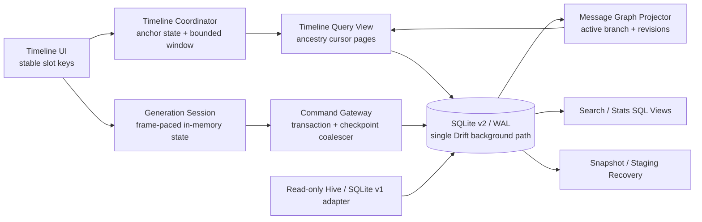
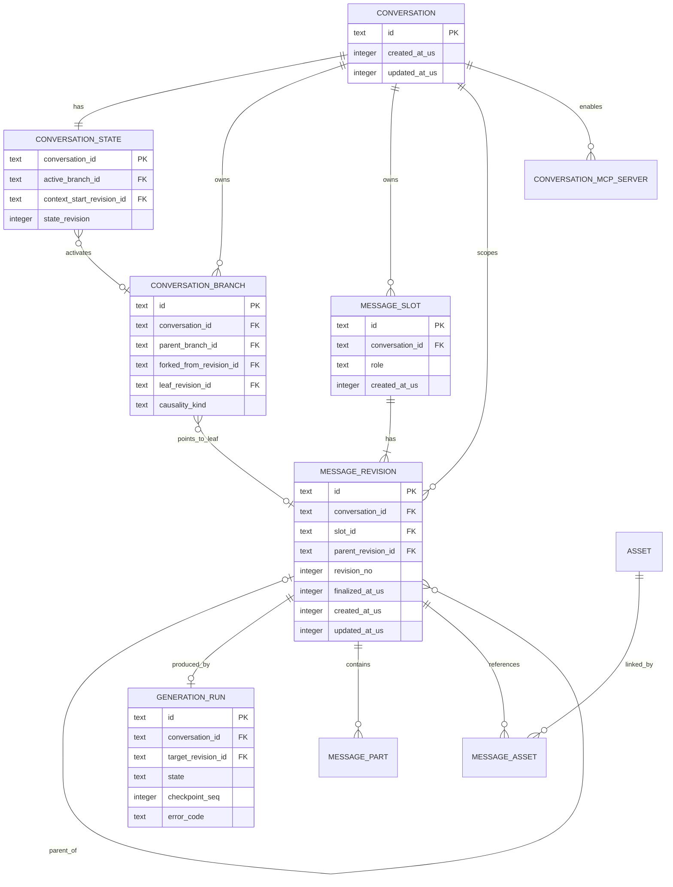
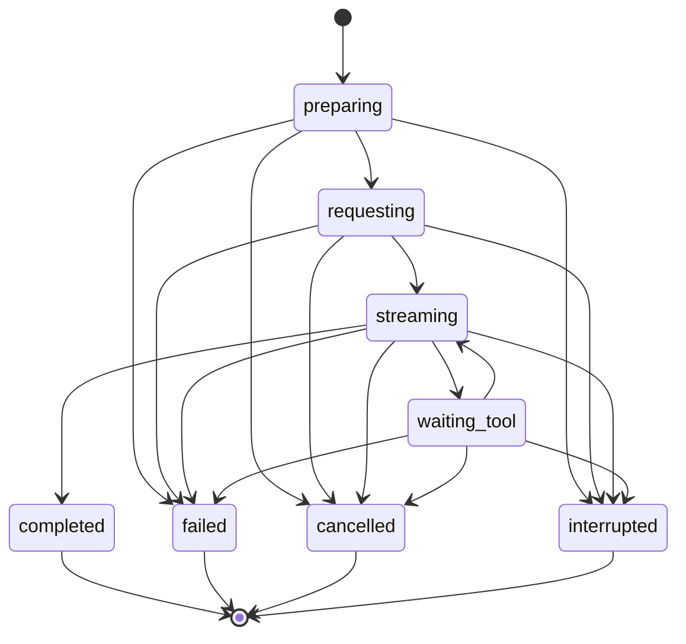
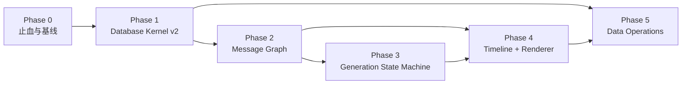

# Kelivo 聊天数据库与消息系统 v2 重构方案

> - 文档状态：设计提案，等待产品决策与性能基线冻结
> - 审计基线：分支 `sql`，提交 `df1dae8a`
> - 最后更新：2026-07-09
> - 实施状态：[chat-database-v2-refactoring-progress.md](./chat-database-v2-refactoring-progress.md)

## 1. 文档目的

本文档把现有 Hive → SQLite 改造审计转化为可实施、可验证、可回滚的重构方案。它是本次重构的稳定设计基线，负责说明：

- 为什么当前实现仍会发生数据风险、OOM、输出卡顿和列表跳动；
- 目标数据模型、模块边界和业务不变量；
- 发送、重生成、多版本、滚动、备份、恢复和异常退出的正确行为；
- 从历史 Hive、当前 SQLite v1 和旧备份迁移到 SQLite v2 的协议；
- 分阶段实施顺序、退出条件、性能目标和故障注入矩阵。

动态任务状态、决策结果、PR、验证命令和实测数据只记录在[进度文档](./chat-database-v2-refactoring-progress.md)，避免本方案被频繁状态更新淹没。

本文使用以下标记：

- **事实**：能由当前代码、测试、配置或 git 历史直接证明。
- **建议**：本方案推荐的目标实现，尚不代表已经完成。
- **待决策**：会改变数据模型或用户行为，不能由实现者自行猜测。

## 2. 执行合同

### 2.1 Primary Setpoint

建立一个以 SQLite/Drift 为唯一聊天数据源、以稳定消息因果图表达多版本、以有界时间线提供流畅交互、在进程崩溃和突然断电后仍保持业务一致性的聊天系统。

### 2.2 Acceptance

重构只有同时满足以下条件才可视为完成：

1. 所有聊天数据库访问均离开 UI isolate，不再存在同步 SQLite 旁路。
2. 每个持久状态转换都是原子的；长时间运行的发送/工具调用失败时留下完整、可恢复的 `failed`/`interrupted` 状态，而不是半状态或永久 loading。
3. 模型上下文只能来自当前分支的真实祖先，不能包含“未来消息”。
4. 版本选择引用稳定 revision ID，不再混用版本号和列表下标。
5. 打开会话、分页、流式输出和备份的内存占用受明确预算约束，不随数据库总量线性增长。
6. prepend、裁窗、版本切换、图片高度变化和窗口 resize 后，视觉锚点漂移满足性能 SLO。
7. 迁移和恢复通过 staging、完整性验证和可恢复切换完成；切换前失败不修改 live，切换中断时在开放业务访问前恢复为完整旧 bundle 或完整新 bundle。
8. 历史 Hive、SQLite v1、备份格式和五个平台均通过规定的兼容性与故障验证。

### 2.3 Guardrails

- 继续使用 SQLite/Drift，不因当前调用方式有问题而更换数据库。
- 禁止长期双写 Hive、SQLite v1 和 SQLite v2。
- 禁止以静默 fallback、吞异常、自动创建空库或假成功掩盖数据事故。
- 禁止为了测试暴露私有内部实现或扩大无关公共 API。
- 不在没有基准数据前加入 cache、mmap、线程池等“性能魔法参数”。
- 不手工修改 Drift、Hive 或本地化生成文件。
- 每个阶段保持可独立发布、可观测、可回滚，不做一次性大爆炸替换。

### 2.4 Boundary

本次范围包括：

- Hive 与当前 SQLite v1 聊天数据迁移；
- 会话、消息、多版本、分支、上下文截断、工具事件和 provider artifacts；
- 流式生成、失败、取消、异常退出和恢复；
- 消息列表分页、滚动锚点、长 Markdown、图片、表格和 Mermaid 缓存；
- 搜索、统计、附件引用、备份、恢复、导入和导出；
- SQLite schema、事务、WAL、完整性检查、跨平台文件切换；
- API key 等秘密与普通备份数据的边界。

不在本次范围内：

- 无关页面的视觉重设计；
- 模型供应商网络协议的整体重写；
- 与聊天数据无关的所有 SharedPreferences 一次性迁移；
- 没有需求依据的通用 ORM、事件总线或分布式同步框架。

## 3. 当前事实与根因

### 3.1 当前已经使用 SQLite，但仍保留 Hive 时代的对象图

当前 Drift schema 位于 [`app_database.dart`](../../lib/core/database/app_database.dart)，聊天主数据已写入 SQLite；但 `Conversation` 和 `ChatMessage` 仍保留 Hive model 形态，服务层仍大量依赖完整 `messageIds`、整会话加载、可变对象和永久缓存。

因此，当前改造主要完成了“存储介质替换”，尚未完成“数据访问模型和消息领域语义重构”。

### 3.2 已确认的高风险链路

| 级别 | 事实 | 直接影响 | 主要证据 |
| --- | --- | --- | --- |
| P0 | Drift 后台连接旁边又打开一个原生同步 SQLite 连接 | 分页、搜索、单条读取仍可阻塞 UI isolate | [`chat_database_repository.dart`](../../lib/core/database/chat_database_repository.dart#L11) |
| P0 | 每个流式 chunk 都暂停订阅、同步读整行、再 UPSERT 增长中的全文 | 网络背压、近似 O(n²) 写放大、输出越长越卡 | [`chat_actions.dart`](../../lib/features/home/controllers/chat_actions.dart#L293)、[`chat_service.dart`](../../lib/core/services/chat/chat_service.dart#L1073) |
| P0 | 新版本物理追加到会话尾部，重生成切点使用物理数组 index | 重生成旧回答时可能把后续未来轮次放入模型上下文 | [`chat_service.dart`](../../lib/core/services/chat/chat_service.dart#L1295)、[`message_generation_service.dart`](../../lib/features/home/services/message_generation_service.dart#L353) |
| P0 | `versionSelections` 同时被当作版本号与排序后数组下标 | 删除版本产生缺口后，UI、搜索和上下文可能选择不同 revision | [`chat_controller.dart`](../../lib/features/home/controllers/chat_controller.dart#L723)、[`home_view_model.dart`](../../lib/features/home/controllers/home_view_model.dart#L573) |
| P0 | 覆盖恢复先清空 live 数据，再逐会话写入；部分异常被吞 | 磁盘满、坏备份或中途退出可留下空库/半库并显示成功 | [`data_sync.dart`](../../lib/core/services/backup/data_sync.dart#L1027) |
| P0 | 迁移替换先删除正式 SQLite family，再逐个 rename 临时文件 | 删除与 rename 之间异常退出可能没有可启动的 live DB | [`hive_to_sqlite_migration_service.dart`](../../lib/features/migration/hive_to_sqlite_migration_service.dart#L1045) |
| P0 | 数据库缺失或损坏时可能直接创建新空库 | 真实数据事故被解释为“正常没有聊天记录” | [`chat_service.dart`](../../lib/core/services/chat/chat_service.dart#L46) |
| P1 | `MAX(message_order)+1` 与 insert 不在同一事务且没有唯一约束 | 并发和 merge restore 可产生重复顺序 | [`chat_database_repository.dart`](../../lib/core/database/chat_database_repository.dart#L458) |
| P1 | 360 条滑窗 prepend 后裁尾，却只按总高度净差补偿；append 裁头无补偿 | 长会话双向分页发生确定性跳动 | [`chat_controller.dart`](../../lib/features/home/controllers/chat_controller.dart#L204)、[`message_list_view.dart`](../../lib/features/home/widgets/message_list_view.dart#L450) |
| P1 | 窗口内出现版本组就同步加载该组全部 revision | 360 条限制不是真实内存上限，多版本长消息仍可 OOM | [`chat_controller.dart`](../../lib/features/home/controllers/chat_controller.dart#L767) |
| P1 | 备份、统计、摘要等继续整会话加载并永久缓存 | 大库操作把全库对象图常驻内存 | [`data_sync.dart`](../../lib/core/services/backup/data_sync.dart#L603)、[`stats_page.dart`](../../lib/features/stats/pages/stats_page.dart#L158) |
| P1 | SharedPreferences 备份可能包含 API key、代理密码和远端备份凭据 | 明文 ZIP 泄露即凭据泄露 | [`data_sync.dart`](../../lib/core/services/backup/data_sync.dart#L1680) |

### 3.3 多版本语义的确定性反例

现有物理顺序可能为：

```text
u1, a1-v0, u2, a2-v0, a1-v1
```

`a1-v1` 在 UI 中仍显示在第一轮 assistant 的逻辑位置，但它的物理 index 已在数组末尾。用户重生成 `a1-v1` 时，当前逻辑把 `lastKeep` 设为该末尾 index，于是 `u2` 和 `a2-v0` 会进入重生成第一轮回答的上下文。

这不是单个 if 判断错误，而是“展示顺序、因果顺序和物理存储顺序共用同一个数组”造成的结构性问题。

### 3.4 滚动锚点算法的确定性反例

设一次向前分页插入旧消息总高度为 `A`，同时为维持 360 条窗口裁掉尾部消息总高度为 `R`：

- 当前算法使用 `newMaxScrollExtent - oldMaxScrollExtent = A - R` 补偿；
- 原有可见消息实际被顶部新增内容推移了 `A`；
- 因此补偿必然少 `R`；当 `A <= R` 时甚至完全不补偿；
- 向后分页裁掉顶部高度时，当前实现没有相应的稳定项补偿。

可变高度 Markdown、图片异步解码、reasoning 展开和版本切换会继续放大这种偏差。

## 4. 领域不变量

下列规则必须由 schema、事务和测试共同强制，不能仅依赖 UI 约定：

1. **数据存在性**：既有安装的数据库缺失、损坏或身份不匹配时，应用必须进入恢复/诊断流程，不得静默创建空库。
2. **状态转换原子性**：每个持久 transition 只能得到完整前态或完整后态；远程生成不是一个长数据库事务，失败必须落为完整的失败/中断状态。
3. **因果路径**：当前模型上下文只能包含 active branch 上目标 revision 的祖先。
4. **稳定引用**：版本选择、上下文边界、分页 cursor 和 UI key 均引用稳定 ID，不引用数组下标。
5. **版本唯一性**：同一 slot 内 `revision_no` 唯一但允许有缺口；任何业务逻辑不得依赖编号连续。
6. **终态单向**：`completed`、`failed`、`cancelled`、`interrupted` 不得被迟到 chunk 改回 streaming。
7. **有界工作集**：UI 窗口、cache、图片、Markdown AST 和备份内存均有数量与字节预算。
8. **失败可见**：数据库、迁移、备份和恢复错误必须保留可定位信息并向调用者传播，不得返回假成功。
9. **秘密隔离**：普通备份默认不包含 API key、密码、session token 或系统安全存储内容。
10. **确定性排序**：时间字段使用 UTC 微秒，所有排序都带稳定唯一 tiebreaker。
11. **同库一致性**：parent、slot、revision、branch 和 selection 必须属于同一 conversation，并由包含 `conversation_id` 的复合 FK/UNIQUE 强制。
12. **可审计迁移**：无法无歧义修复的数据进入 recovered/rejects 记录并提示，不得静默丢弃或猜测。
13. **路径唯一性**：同一 active branch ancestry 中，一个 slot 最多出现一个 revision。

## 5. 必须先确定的产品决策

以下决定会改变 schema、迁移和用户交互。默认建议可用于原型，但进入消息图实现前必须正式确认。

| ID | 待决策问题 | 推荐默认值 | 阻塞阶段 |
| --- | --- | --- | --- |
| PD-01 | 多版本采用真实分支，还是切换旧版本后仍无条件保留未来对话 | 真实分支；旧未来保留在旧 branch | Phase 2 |
| PD-02 | 编辑 user、重生成 assistant、删除 revision 后如何处理后代 | 创建/切换 branch，不物理删除旧后代；显式操作再 GC | Phase 2 |
| PD-03 | 中断输出如何展示，是否允许继续 | 保留 partial content，显示 `interrupted`，提供重试/删除 | Phase 3 |
| PD-04 | 用户在历史位置发送时的行为 | 从该位置创建新 branch，并保持该位置锚点直到首个新响应可见 | Phase 2/4 |
| PD-05 | 用户离开底部时，新内容如何提示 | 不强制跳动；显示“有新内容”，用户主动恢复 following tail | Phase 4 |
| PD-06 | 搜索范围 | 默认当前可见 branch，可显式搜索所有 revisions | Phase 5 |
| PD-07 | 统计范围 | 默认当前 active branch，另列全部生成消耗 | Phase 5 |
| PD-08 | 备份是否包含失败/中断 revision 和全部 branch | 完整备份包含；便携导出允许显式裁剪 | Phase 5 |
| PD-09 | restore merge 遇到相同 ID 如何处理 | 内容 hash 相同去重；不同则重新映射 ID 并记录冲突 | Phase 0/5 |
| PD-10 | 旧数据库保留期和清理授权 | 至少一次成功启动 + 明确保留周期，清理前可导出诊断信息 | Phase 1/5 |
| PD-11 | 聊天数据库是否需要应用层加密 | 单独安全评估；秘密必须立即移出明文普通备份 | Phase 0/5 |
| PD-12 | 损坏数据的恢复体验 | 只读恢复页，可导出 rejects/诊断包，用户决定继续或回滚 | Phase 1/5 |
| PD-13 | SQLite v1 是否已经发布给真实用户 | 以发布事实确认；若已发布，v1 必须是迁移主源 | Phase 0 |

### 5.1 已冻结的补充决策

- **PD-14（2026-07-09，用户确认）**：应用正常的完整备份以 SQLite 一致快照为聊天主数据，ZIP 内不再生成 `chats.json`。ZIP 同时携带格式 manifest、非秘密 settings snapshot 和选中的 assets。
- 正常备份 manifest 的 `secretsIncluded: false` 表示已移除应用已知的认证凭据字段（API key、password、token、认证 header/body、带凭据 URL 等），不代表聊天、提示词、附件等自由文本绝不含用户手工粘贴的秘密。
- 恢复无秘密的新 bundle 时，overwrite 必须先清除目标端已知凭据族，避免旧凭据残留；用户在恢复后重新填写凭据。merge 在凭据与冲突语义完成前明确拒绝，不做隐式保留或覆盖。
- 旧 `chats.json`/ZIP 必须继续通过只读 legacy adapter 导入；它不是新备份的写出格式。
- 旧 JSON 导入和 Hive → SQLite 迁移页灾难备份继续保持历史设置语义，因而可能包含明文凭据；它们不经过正常备份 sanitizer。该历史路径允许比新格式慢，但仍应使用流式 ZIP/文件写入、分批扫描和有界中间对象，尽力避免 OOM 与长时间阻塞。
- NDJSON/chunk 仅用于显式便携导出或 legacy/v2 数据转换，不作为应用默认完整备份格式。

## 6. 目标架构

### 6.1 总体数据流



### 6.2 模块边界

#### A. Database Kernel

职责：

- 只创建一个受控的 Drift/SQLite 后台通路；
- 统一连接 PRAGMA、schema version、migration、transaction 和查询观测；
- 提供受类型约束的异步 DAO 与领域命令；
- 强制 FK、UNIQUE、CHECK、时间精度和稳定排序；
- 隔离 sqlite3、WAL、checkpoint 和平台文件操作细节。

禁止：

- UI、controller 或 service 直接打开 raw SQLite；
- 同步数据库 API；
- 调用者自行执行 `MAX(order)+1`、多步更新和 JSON read-modify-write。

#### B. Message Graph

职责：

- 表达 conversation、branch、slot、revision 和 parent revision；
- 从 active branch leaf 投影唯一真实上下文；
- 处理编辑、重生成、切换 revision、fork 和 context boundary；
- 保证旧 branch 可恢复，但不参与当前 timeline 分页和 prompt。

#### C. Generation Coordinator

职责：

- 管理 prepare、request、stream、tool、complete、failure、cancel 和 interrupt；
- 将网络接收、UI 发布和数据库 checkpoint 解耦；
- 以 generation ID 收尾，不依赖消息是否仍在 UI 窗口；
- 保证终态不可回退，partial content 可恢复。

#### D. Timeline Coordinator

职责：

- 按 active branch 的稳定 ancestry cursor 加载逻辑 slot；
- 同时执行行数预算和解码字节预算；
- 维护 following tail、user anchored、programmatic jump、loading 状态机；
- 使用 slot ID 和 viewport 局部偏移保持视觉锚点。

#### E. Data Operations

职责：

- staging migration、backup snapshot、restore、merge 和 crash-safe swap；
- SQL 聚合、FTS、附件引用与延迟 GC；
- 数据库身份、迁移 receipt、完整性检查和恢复入口；
- portable export 的 schema、manifest、hash 和兼容策略。

### 6.3 目标数据模型



建议表及职责：

| 表 | 主要职责 | 核心约束 |
| --- | --- | --- |
| `conversations` | 不带循环引用的会话元数据 | ID 稳定；时间使用 UTC 微秒 |
| `conversation_state` | active branch、context boundary 和乐观并发版本 | `(conversation_id, active_branch_id)`、`(conversation_id, context_start_revision_id)` 复合 FK；空会话允许引用为空 |
| `conversation_branches` | 保存可切换的 branch head 与 legacy 因果可信度 | `UNIQUE(conversation_id, id)`；leaf、parent branch、fork revision 使用同会话复合 FK |
| `message_slots` | 稳定逻辑消息位置和 UI identity | `UNIQUE(conversation_id, id)`；`role` CHECK；切 revision 不改变 ID |
| `message_revisions` | revision metadata、因果 parent 和 finalization | `UNIQUE(conversation_id, id)`、`UNIQUE(conversation_id, slot_id, revision_no)`；slot/parent 使用同会话复合 FK |
| `generation_runs` | 生成生命周期、checkpoint 和错误 | 一个 target revision 最多一个活动 run；checkpoint 单调递增 |
| `message_parts` | text、reasoning、tool call/result 的唯一权威 payload | `UNIQUE(conversation_id, message_revision_id, ordinal)`；active run 可 checkpoint，finalize 后不可变 |
| `provider_artifacts` | Gemini signature 等供应商数据 | `PRIMARY KEY(message_revision_id, kind)` |
| `assets` | 文件 hash、mime、尺寸、管理路径和状态 | hash/路径策略唯一；禁止正文 regex 作为唯一引用源 |
| `message_assets` | revision 与 asset 的关联 | FK；删除 revision 后由引用计数/GC 处理 |
| `conversation_mcp_servers` | 会话 MCP 配置 | `UNIQUE(conversation_id, ordinal)` |
| `migration_runs` | 迁移来源、hash、阶段和计数 | run ID 与 source hash 唯一，支持幂等重试 |
| `migration_issues` | selection/因果歧义、orphan、rejects 与用户可见处置 | 关联 migration run 和 source entity；问题不得只存在日志中 |

说明：

- 所有跨 conversation 的引用都在子表冗余 `conversation_id`，并通过 composite FK 指向 `UNIQUE(conversation_id, id)`；不能只靠应用层判断。
- active branch/context 引用从 `conversations` 拆到 `conversation_state`，先创建 conversation/slot/revision/branch，再在同一事务末尾更新 state，避免循环 FK 创建顺序。
- active path 由 branch leaf 沿 `parent_revision_id` 反向遍历得到，反转后即为展示和模型上下文顺序。
- 同一 slot 的不同 revision 可以拥有不同 parent，因而能表达“同一逻辑位置基于不同历史产生的版本”。
- branch 只保存 head 和 fork 元数据，不复制大段 message content。
- selection 不再是 conversation 上的 JSON；active path 中实际出现的 revision 就是该 branch 的选择。
- `revision_no` 仅用于显示和同 slot 排序，不作为选择、cursor 或上下文边界。
- `generation_runs.state` 是生成生命周期的唯一真相；`isStreaming` 等 UI 状态由它投影，revision 不再保存第二套竞争状态。
- `message_parts` 是消息正文的唯一真相。`message_revisions` 不再重复保存 `content`；若将来为查询性能增加 text projection，它必须是带 hash/version、可删除重建的派生数据。
- `conversation_branches.causality_kind` 至少区分 `native`、`legacy_visible_projection` 和 `legacy_ambiguous`，旧扁平历史不得伪装为已知真实因果图。

如果 PD-01 最终决定不支持真实分支，可简化 `conversation_branches`，但仍必须保留稳定 slot、revision ID、FK selection 和逻辑分页，不能回到 JSON ordinal。

## 7. 关键业务流程

### 7.1 发送消息

1. 在写库前完成不会改变状态的输入校验、文件可读性检查和 provider 参数准备。
2. `beginSend` 在一个事务内：
   - 创建 user slot/revision 和权威 text part；
   - 创建 assistant slot/revision 和空 text part；
   - 创建 `generation_run(state=preparing)`；
   - 更新 active branch leaf 和 conversation 时间。
3. 请求开始时以条件更新进入 `requesting`，收到内容后进入 `streaming`。
4. 网络层只按序追加 buffer，不等待 UI 绘制和数据库 commit。
5. UI 以 frame/coalesced 节奏发布最新 snapshot。
6. 持久层使用单 writer、latest-wins checkpoint queue，每 250–500ms 或新增 4–16KiB 合并更新权威 text part 和单调 `checkpoint_seq`。
7. final 先关闭新 checkpoint 入队，等待/取消旧 snapshot，并用 barrier 串行执行最终 parts、usage、finalized time、provider artifacts 和 `completed` 事务；旧 checkpoint 永远不能越过 final。
8. prepare、网络、解析、工具或持久化失败统一进入明确终态并清理 loading；错误信息不写入权威 message parts。

### 7.2 重生成和编辑

- 重生成 assistant：在同一 slot 创建新 revision，其 parent 指向目标 assistant 之前的真实 revision；创建新 branch head。
- 编辑 user：从该 user 之前的 revision fork，创建新的 user revision，再创建新的 assistant generation。
- 旧 branch 和旧后代不进入新 prompt，但在用户切回旧 revision 时仍可访问。
- 删除后续不是逐行物理删除和全表 compact，而是创建/切换到截止于目标 revision 的 branch；物理 GC 延迟执行。
- fork conversation 初期可以复制 graph 元数据引用或批量克隆；不得逐条大内容同步写并构造半个会话。

上下文构建必须只接受 branch/revision 身份，不接受 raw list index：

```text
active branch leaf
  -> follow parent_revision_id
  -> stop at context_start_revision_id or policy budget
  -> reverse
  -> project ordered message parts
  -> apply token budget
```

### 7.3 生成状态机



状态规则：

- 所有 transition 使用条件更新或等价 CAS，迟到 chunk 不能覆盖终态。
- cancel 使用 `generation_run.id`，不在当前 360 条窗口里寻找消息。
- 应用启动时在一个事务内把所有非终态 run 标记为 `interrupted`，保留最后 checkpoint。
- 同一个 conversation 的领域命令串行化；数据库约束作为第二道防线。
- iOS background activity、通知和桌面状态更新与数据库一样合并节流，不允许逐 chunk MethodChannel 阻塞网络流。

### 7.4 时间线分页和滚动

分页单位必须是 active branch 上的逻辑 slot，不是物理 revision 行：

- 初始只加载尾部 30–50 个逻辑 slot；
- `beforeRevisionId` / `afterRevisionId` 是稳定 cursor；
- 版本列表仅在展示版本控制或用户切换时按 slot 懒加载；
- 内存窗口同时受逻辑行数和解码字节数预算限制；
- 裁剪不得删除当前视觉 anchor；陈旧异步请求必须可取消或丢弃结果。

滚动状态机：

- `followingTail`：用户在底部，新增内容保持尾随；
- `userAnchored(slotId, localDy)`：用户阅读历史，新增内容不改变该 slot 的 viewport 位置；
- `programmaticJump`：搜索、问题导航或用户点击跳转；
- `loading`：分页进行中，保留上一个稳定状态。

正确锚点算法：

1. 数据变化前记录第一个完整可见 slot 的 `slotId` 和相对 viewport 顶部的 `localDy`。
2. 异步加载、合并和按预算裁窗；外层 item key 始终为 slot ID。
3. 新布局完成后查找同一 slot，计算新的局部偏移。
4. 只修正 `newDy - oldDy`，不使用总 `maxScrollExtent` 差值。
5. 图片、表格完成布局、reasoning 展开、版本切换和窗口 resize 都走同一锚定机制。

桌面和移动共享时间线核心，但分别验证触控、fling、键盘 resize、滚轮、触控板、scrollbar、文本选择、右键菜单和窗口 resize。

### 7.5 渲染与缓存

- 构建一次 `MessageRenderModel`，预计算 latest assistant、版本计数、selected revision 和可见 parts，禁止每行重复扫描全列表。
- 已完成 Markdown block 解析一次并缓存，流式时只重解析最后一个未闭合 block。
- `AnimatedSize` 不包裹整份持续增长的长 Markdown。
- 图片保存原始宽高并预留 `AspectRatio`；按目标物理像素使用 `cacheWidth/cacheHeight` 或等价 resize。
- AST、highlight、Mermaid bitmap、图片和消息页缓存全部使用字节 LRU，不只限制条目数。
- 超长表格、代码和 tool result 使用折叠/虚拟化独立视图，不在主消息树一次构造数千行 widget。
- UI 订阅粒度落到单条 render model；侧栏、滚动按钮等状态变化不得清空消息数据 cache。

### 7.6 搜索、统计与附件

- 统计通过 SQL aggregate/view 计算，不实例化全库 `ChatMessage`。
- 搜索使用 FTS5 或经五平台验证的等价索引：
  - 三个及以上 Unicode 字符评估 trigram substring；
  - 一至两个中文字符采用实测后的受限 fallback；
  - 当前 branch 与所有 revisions 的范围由 PD-06 决定。
- 每个搜索结果保存 branch/revision identity，导航时可恢复对应路径和 slot anchor。
- 附件由 `assets` / `message_assets` FK 管理，删除消息只更新引用；空闲期批量 GC，禁止每次删除扫描全库和整个文件系统。
- 对 FTS、统计和缓存等派生数据提供可重建机制，不把它们作为唯一用户数据。

## 8. SQLite 事务、WAL 与耐久策略

### 8.1 连接策略

- 删除 `_syncDb` 和全部同步 repository API。
- 应用进程内只允许一个数据库 gateway；初始化使用 single-flight Future。
- 初始不额外开启 read pool，只有基准证明并行读确有收益时才增加。
- 打开数据库先读取 header/`user_version`。若 schema 高于当前二进制支持版本，必须拒绝写入并进入“需要更新应用”的只读/诊断状态；禁止降级 migration、创建空表或覆盖文件。
- 每个平台启动后读取并断言关键 SQLite capability 与 PRAGMA 实际值，不依赖编译默认值。
- 桌面确认单实例或显式数据库写锁策略，避免两个进程并发运行迁移/恢复。

### 8.2 初始连接合同

以下为建议起点，最终值必须由 Phase 0/1 benchmark 冻结：

- `journal_mode=WAL`
- `foreign_keys=ON`
- `busy_timeout=5000`
- `synchronous=FULL`：需求明确重视突然断电；若实测不可接受，再记录可见的耐久取舍
- 显式设置并观测 `wal_autocheckpoint`、`journal_size_limit`
- 使用有界 cache；不在无测量前启用大 mmap/cache
- 空闲期执行 `PRAGMA optimize`
- 大规模删除使用评估后的 incremental vacuum 策略

`synchronous=FULL` 只能提高单事务耐久性，不能修复被拆成多个事务的领域操作。因此必须先收口事务边界，再调优 PRAGMA。

### 8.3 事务边界

下列操作必须各自在单一事务中完成：

- append user + assistant placeholder + run + branch head；
- append revision + 创建/切换 branch；
- generation final authoritative parts + usage + finalized time + run state；
- fail/cancel/interruption收尾；
- 删除 revision/branch 并修复 active head；
- fork；
- 一批导入/merge 的确定性映射；
- 一次 schema migration step。

不再保持连续 `message_order`，删除不触发全量 compact。若仍需要显示 sequence，应使用稳定稀疏序号或 parent path，并由唯一约束兜底。

### 8.4 完整性检查策略

- 正常启动不做全库扫描。
- unclean shutdown、打开错误、身份不匹配时运行 `quick_check` 和必要的业务不变量检查。
- migration/restore candidate 在切换前运行完整 `integrity_check`、`foreign_key_check`、ID/hash/branch 无环验证。
- 支持页提供显式深度检查和脱敏诊断包。
- JSON 解码失败不得静默返回空 map/list；应记录字段、实体 ID 和可恢复错误。

## 9. 迁移、恢复与回滚协议

### 9.1 数据源优先级

1. 如果 SQLite v1 已向用户发布，它是迁移主源。
2. Hive 只作为历史迁移源、孤儿恢复源和时间精度辅助，不得盲目覆盖更新的 SQLite 数据。
3. 旧备份按明确格式版本导入，不以“能 jsonDecode”代表兼容。
4. 任何 source 均先转入 candidate v2，不直接修改 live。

### 9.2 Preflight

迁移或恢复开始前必须：

- 确认数据目录、权限、可用磁盘空间和平台 SQLite capability；
- 计算 source 文件 SHA-256、数据库身份和格式/schema version；
- 扫描 conversation/message/tool/signature/asset 的 ID 集与引用差集；
- 检测重复 ID/order/version、非法 role/run state、损坏 JSON、缺 parent 和缺附件；
- 生成经过重新打开验证的备份；
- 创建 `migration_run` 与同目录持久化 receipt。

### 9.3 Legacy → v2 映射

- legacy group key 使用 `COALESCE(group_id, id)`。
- slot anchor 取该组最小 `message_order`，平手使用 timestamp 与 ID 确定性排序。
- 旧 selection 同时计算两种候选：按排序数组 ordinal 解析，以及按 `version` 值匹配。
  - 两种解释指向同一 revision，或只有一种解释合法时，记录确定结果；
  - 两种解释都合法但指向不同 revision 时，写入 `migration_issues(selection_ambiguous)`，保留两个候选；`legacy-main` 使用当前主聊天 UI 可见的 ordinal 投影以维持升级前画面，但必须在迁移报告中提示，不能宣称已经恢复用户原意；
  - 两种解释都不合法时，按旧 UI 的 latest fallback 创建可见投影，同时记录 recoverable issue。
- `truncateIndex` 映射为稳定 context boundary；若落在 group 内部，记录 warning。
- 所有 `isStreaming=true` 迁移为 `interrupted`，保留 partial content。
- 孤儿消息进入明确的 Recovered conversation；无法恢复的记录写入 rejects。
- 工具事件、reasoning、translation、token usage、Gemini signature、MCP 和附件均纳入 count/hash 验证。
- SQLite v1 已丢失的亚秒时间精度不能伪造；只有能由可信 Hive source 对应恢复时才补回。
- FTS、统计和 cache 在 v2 数据验证后重建，不从旧派生数据直接复制。

旧扁平顺序无法证明“后续消息究竟基于同 slot 的哪个 revision”。迁移只能构造 `legacy_visible_projection`：

- `legacy-main` 精确保留升级前主聊天 UI 的可见线性序列和 context boundary；
- 未选中的 revisions 作为同 slot alternates 保留，但不伪造它们与旧后代的因果关系；
- 存在 selection 或顺序歧义的 branch 标记为 `legacy_ambiguous`，详情写入 `migration_issues`；
- 用户从 ambiguous alternate 继续时，默认从该 revision 创建新 native branch，不自动附加因果未知的旧后续；原 `legacy-main` 完整保留；
- legacy candidate 验证比较“升级前可见序列 digest”，不声称比较无法获知的真实历史 ancestor digest。

### 9.4 Candidate 验证

切换前至少验证：

- 每表 count、ID 集和 source → target 映射数量；
- native 会话验证 active path；legacy 会话验证升级前可见投影顺序 digest；
- authoritative message parts/reasoning/tool/signature/selection candidate/asset digest；
- branch 可从 leaf 追溯到 root、无环、parent 同 conversation；
- 同一路径 slot 不重复；selection/active branch/context boundary 引用有效；
- `PRAGMA integrity_check`；
- `PRAGMA foreign_key_check`；
- 关键查询 `EXPLAIN QUERY PLAN` 使用预期索引；
- candidate reopen 后读取业务快照与 migration manifest 一致。

### 9.5 Crash-safe swap 状态机

```text
discovered
  -> preflighted
  -> building
  -> validated
  -> prepared
  -> old_renamed
  -> new_installed
  -> verified
  -> committed

old_renamed | new_installed | verified
  -> rolling_back
  -> rolled_back

committed | rolled_back
  -> settings_cold_ack
  -> next_process_readback
  -> archived_and_business_ready
```

协议：

1. 运行期只在 AppData 同卷目录完成 candidate staging、验证和 `prepared` receipt，不修改 live。现有恢复交互在成功后强制要求重启，切换利用该边界完成。
2. 每个业务进程必须在第一次业务持久化读取前非阻塞获取并持有 AppData 级 business lease 直至进程退出；下一次启动只有在确认没有旧实例/第二实例仍可能写 SharedPreferences、SQLite 或 assets 后，才运行唯一 restore gate。未取得 lease 或未达到可判定终态时不得创建业务 provider 或打开数据库。
3. candidate 执行 WAL checkpoint/TRUNCATE，关闭所有连接，确保不依赖 `-wal/-shm` 才完整；规范化 candidate 记录 post-normalization hash，不能复用 ZIP manifest 中规范化前的 DB hash。
4. receipt journal 使用 append-only“写唯一临时文件 → file/full barrier → 无覆盖发布下一个 sequence → parent directory barrier”，包含单调 sequence、previous checksum 与 payload checksum；candidate、manifest 和目录也完成对应 barrier。POSIX 使用 file/directory fsync，跨目录 rename 先同步 target parent、再同步 source parent；Apple 在 phase 的目录元数据完成后额外使用 `F_FULLFSYNC`，Windows rename 使用 write-through；实现存在不等于五平台和真实断电已经验证。
5. 启动 gate 内建立 previous bundle；旧 assets 在第一次 destructive rename 前逐文件同步、目录树自底向上同步并重新校验 descriptor。随后 live rename 为 `.previous`，持久化 `old_renamed`；candidate rename 为 live，持久化 `new_installed`。
6. reopen live，运行 quick check 和业务快照验证，标记 `verified`。`verified` 仍是 restore gate 内部状态：此时不得创建业务 provider、开放数据库或接受任何新写入，验证失败或 gate 被 kill 后仍可安全回滚。
7. restore gate 必须在第一次业务读取和 `runApp` 前把已验证的新 bundle 标记为 `committed`；`committed` 或经完整旧 bundle 复验的 `rolled_back` 仍只是数据终态，不等于 settings 已跨断电持久。terminal receipt 必须继续留在 active admission，并写入绑定 receipt/expected/native PID/lease acquisition token 的 canonical `settings_cold_ack.json`；同一 PID 或同一 token 都不得自行确认，PID 被复用时保守继续阻止业务。下一进程从平台持久层读到精确 target/before，且以 settings 零写入方式再次复验真实 DB/assets/previous/candidate 后，才能归档并放行业务；若只读到可证明的 before/target 部分态，则可重写 settings、轮换 ack 并再次要求冷启动；未知偏离继续 fail-closed。`committed` 绝不自动回退，`rolled_back` 可重复同一幂等反向文件操作并明确通知用户旧数据已保留。旧 bundle 的保留期、成功启动次数和最终清理由独立 retention 记录管理，不能通过延迟 `committed` 或无记录删除 evidence 表达。
8. 任一步被 kill 后，下一次启动根据 receipt、DB UUID、hash 和校验结果选择唯一有效副本，绝不凭文件名猜测。只有在不存在任何 final receipt，且 marker/run/candidate/receipt-temp 拓扑严格证明仍处于未发布 staging 时，gate 才可用 operation-ahead `discarding` marker 耐久清理；previous、链接、特殊文件、未知项、身份不一致或任何 final receipt 都必须保留现场并 fail-closed。

`prepared → old_renamed` 必须先持久化 `previous.pending/manifest.json`，再开始移动任何 live 对象。该计划使用 canonical checksum，并绑定 run ID、prepared receipt checksum、candidate manifest SHA-256、selected components、旧 settings snapshot descriptor/fingerprint、DB 是否缺失或其 descriptor，以及 upload/images/avatars/fonts 每个根的“缺失/目录”状态和逐文件 descriptor。缺失、空目录和未选择是三种不同语义，不得合并。

逐组件 rename 允许物理状态领先 receipt：kill 后同一对象必须能由计划证明恰好位于 live、`previous.pending`/`previous` 或 candidate 中的一个合法位置；重复副本、全部缺失、hash/type 不符或缺少有效计划时 fail-closed。完整 previous 验证后先执行 `previous.pending → previous` 并 fsync run 目录，最后才发布 `old_renamed`。

settings 不是可跨平台 rename 的普通文件。当前兼容语义冻结为：保留 local-only keys；candidate 中的非 local-only keys 覆盖；secret-free restore 清除已知凭据族；candidate 缺失的其他普通 key 暂时保留。previous 只保存 touched keys 的原值/不存在 tombstone 和 before/target fingerprint，启动 gate 通过可重入 apply + reload/fingerprint 完成或回滚。严格删除 candidate 缺失的全部普通 key 必须等待 Kelivo managed-key registry，不能直接 `SharedPreferences.clear()`。previous settings 可能含旧凭据，必须限制权限、保留期和诊断导出范围。

pre-commit 回滚必须使用独立的 operation-ahead `rolling_back` receipt：先确认 candidate manifest、previous manifest、settings touched-key 投影以及每个 DB/assets 对象都处于 descriptor 可证明的 candidate/live/previous 唯一位置，再持久化 `rolling_back`；随后把已安装的新对象从 live 退回 candidate、把 previous 旧对象恢复到 live，并按 previous settings snapshot 可重入回滚。重启遇到 `rolling_back` 只能继续同一反向操作。只有在 live 完整匹配 previous、candidate 再次完整、previous 只剩受保护的 control evidence 且 settings before fingerprint 复验通过后，才能发布 `rolled_back`。receipt/manifest 损坏、对象重复/全缺失/出现第三 descriptor、`rolling_back` receipt 无法持久化或已经 `committed` 时不得自动回滚，必须 fail-closed。

live SQLite 在 previous descriptor 生成前必须确保没有业务 handle，执行 checkpoint/TRUNCATE、切换为不依赖 WAL 的 journal 状态，确认 `-wal/-shm/-journal` 消失，并同步 main file 与 parent directory；不能只复制或 rename 一个仍依赖 sidecar 的主文件。

Windows 必须在关闭所有 Drift/raw handle 后测试 rename；POSIX 的单次 rename 原子性也不能替代跨两个 rename 的状态机和目录 fsync。

### 9.6 恢复与备份

- 应用默认完整备份使用 SQLite Online Backup API 或经验证的 `VACUUM INTO` 生成单文件一致快照；ZIP 固定写入 `database/kelivo.sqlite`，不得直接复制可能依赖未 checkpoint WAL 的 live 主文件。
- 默认完整备份不写 `chats.json`。SQLite snapshot、manifest、非秘密 settings snapshot 与选中的 assets 共同组成一个版本化 bundle。
- 旧 `chats.json`/ZIP 只读兼容导入继续保留；迁移页灾难备份继续写 JSON。两者不得反向污染新备份格式。
- 显式便携导出采用逐行 NDJSON/chunk，不构造全量 Map/List。
- manifest 包含格式、schema、app version、DB UUID、counts、entry hash 和 asset hash。
- ZIP 读取限制总展开大小、单条大小和路径；防止 zip bomb 与路径穿越。
- restore overwrite 和 merge 都先在 staging 副本完成；切换开始前失败时 live DB、设置和资源目录不变。
- v2 overwrite 在运行期完成 durable staging 后返回“等待重启”，实际切换由下一次启动的 restore gate 执行；不得在已打开 Drift/raw SQLite handle 或活跃消息流时做文件切换。
- staging 只保存“用户选择 ∩ bundle 能力”的组件，settings 始终保留；未选择的 DB/assets 不得二次复制或进入 completed evidence。candidate manifest 必须重写为所选组件的规范化 DB 与实际 staged entries 的 hash/size，且 candidate 的 `includeChats/includeFiles` 必须与 receipt 精确相等，不能继续引用 ZIP 中规范化前的 DB hash。
- 所选 candidate 声明 `includeFiles: true` 时，必须显式创建 upload/images/avatars/fonts 四个根；某根没有文件表示 overwrite 后清空该根，而不是保留 live 旧文件。所选 candidate 的 `includeFiles: false` 才表示不触碰 live assets，即使源 ZIP 本身包含 assets 也不得复制或归档它们。
- DB、settings、assets 不可能共享一个文件系统事务。切换期间必须阻止正常业务访问，分别保留 staged/previous bundle，并由同一恢复 receipt 在下次开放应用前完成或回滚，使用户只能观察到完整旧 bundle 或完整新 bundle。
- settings 必须先生成可恢复的 staged/previous snapshot，不能在 live SharedPreferences 上逐 key 直接写；assets 使用 staging 目录和 manifest。
- SharedPreferences 写入完成和同进程 reload 都不等于已跨断电持久落盘；启动 gate 必须保留 active terminal evidence，要求 native PID 与 lease acquisition token 均不同的冷启动从平台持久层复验规范化 settings fingerprint。需要重写时不得放行业务，并继续要求下一次冷启动确认。
- 运行期异常补偿只用于当前版本止血，不属于 kill/断电安全证明；完整验收必须创建新进程实例并覆盖每个 receipt 状态的幂等恢复。
- receipt 损坏、丢失、sequence 回退、多个 candidate/previous 冲突都要有 failpoint，并进入显式恢复流程。
- 默认备份移除应用已知认证凭据；自由文本仍可能包含用户手工粘贴的秘密，不得把 `secretsIncluded: false` 描述为整个 ZIP 的绝对无秘密保证。
- secret-free overwrite 在写入设置前清除目标端已知凭据族，恢复后要求用户重新填写；v2 bundle merge 在完成凭据保留/覆盖与冲突报告语义前明确拒绝。
- `secretsIncluded: false` 是可验证声明：candidate settings 必须在 prepared receipt 发布前通过同一 sanitizer 的幂等校验；仍含应用已知凭据的 hash-valid bundle 直接拒绝并清理未发布 run。

真实进程恢复 harness 必须由独立宿主启动平台 Runner，不能从另一个 `flutter test` 内递归启动。宿主只可在 Runner 已将精确 failpoint event 耐久发布后，对 event 中的原生 PID 发送强杀信号；发信号前必须再次匹配测试专用 executable、PID 与进程启动身份，不能只凭可能复用的裸 PID，也不能把终止外层 Flutter CLI、同进程抛异常或人工伪造 PID 当作 kill 证据。测试使用固定的专用 bundle/container 和随机偏好前缀，与正式应用数据隔离；每个阶段使用新 Runner，从真实平台 preferences 后端读回，并用不同 PID 与 business-lease token 证明 cold boundary。宿主还必须持有单实例锁，避免多个 harness 争用 Flutter build/temp/DART_DEFINES；每个阶段启动前记录既有测试 Runner 基线，event 缺失/损坏时也只清理本阶段新出现且身份仍匹配的 Runner，失败时保留 scenario 与有界日志。此类 SIGKILL 测试只证明对应 OS/文件系统上的进程崩溃恢复，不等同于硬件断电或其他平台验证。
- 旧 JSON 导入和迁移页 JSON 灾难备份为兼容历史数据保留原设置内容，可能包含明文凭据；如产品支持正常路径的秘密导出，必须显式选择并使用经过认证的加密格式。
- 上层只有在 snapshot/ZIP 重开验证完成后才能显示“备份成功”；v2 restore preparation 只能显示“已准备，重启后应用”，不能提前显示“恢复完成”。terminal 切换后若仍等待跨进程 settings readback，只能显示不创建业务 provider 的本地化“再冷启动一次”页面；Android 必须请求 process restart，不能只重建 Activity/Flutter engine。自动回滚必须显式告知用户，无法证明旧/新 bundle 完整时只打开不接触业务持久化的本地化 fail-closed 页面。

### 9.7 回滚边界

- **切换前失败**：继续使用旧库，无用户数据损失。
- **gate 尚未 `committed` 且业务从未放行**：可根据 receipt 回退 `.previous`。
- **已经 `committed`/放行业务**：无论是否能证明已有 v2 新写入，都不得自动恢复旧 snapshot，否则存在丢失切换后消息或设置的风险。优先发布兼容 v2 schema 的代码回滚；若必须回 v1，需导出/重放增量并明确用户可见的数据损失边界。
- **数据库 schema 高于二进制支持版本**：只读/拒绝打开并要求升级；禁止执行 down migration、初始化空 schema 或写入 `.previous`。
- `.previous` 是切换恢复工具，不是允许旧二进制无限期降级的双写副本。
- 移除 Hive adapter、Hive 文件和 v1 reader 前，必须满足保留期、成功启动次数、迁移指标和支持策略。

## 10. 数据与版本兼容矩阵

| 来源/操作 | v2 要求 | 失败策略 |
| --- | --- | --- |
| 历史 Hive | 全量 key 扫描、孤儿恢复、adapter fixture 覆盖 | rejects + Recovered conversation，不静默丢弃 |
| 当前 SQLite v1 | 作为已发布数据主源处理；schema snapshot + migrateAndValidate | 保留 v1 snapshot，阻止切换 |
| 旧 `chats.json`/ZIP | 只读 legacy adapter；检查格式版本、引用与可恢复问题；尽量流式导入 | 未知/损坏格式明确拒绝；受损实体进入 Recovered/rejects |
| Chatbox/Cherry import | 在 staging 上做 ID 映射和冲突处理 | 冲突报告，不覆盖无关记录 |
| 默认 SQLite snapshot ZIP → 当前应用 | `database/kelivo.sqlite` + manifest/settings/assets；打开、迁移、hash 与完整性验证后 staging 切换 | hash/不变量不符则不切换 |
| 迁移页 JSON 灾难备份 | 继续支持 Hive 原始数据与设置恢复；分批/流式写出 | 允许旧路径较慢，但错误必须可见且不得 OOM 后伪造成功 |
| v2 backup → v2 | 完整 branch/run/parts/assets round trip | hash/不变量不符则不切换 |
| v2 export → 旧应用 | 默认不支持直接打开 | 提供显式兼容导出，不伪装格式版本 |
| v2 应用代码回滚 | 回滚版本仍需理解 v2 schema | 禁止旧二进制直接写 `.previous` |
| DB schema 高于二进制支持版本 | 只读/拒绝打开并要求升级 | 禁止降级 migration、空库初始化和任何写入 |
| 搜索/统计索引 | 从用户数据可重建 | 删除后重建，不影响主数据 |

兼容性审计必须覆盖：

- 会话 metadata、summary、suggestions、MCP；
- content、role、model/provider、token usage、reasoning timing/segments、translation；
- tool events、provider signature、attachments；
- version、selection、truncate boundary、timestamp 和顺序；
- drafts、temporary conversation 的明确持久化边界；
- orphan、重复值、缺失文件和损坏 JSON。

## 11. 分阶段实施方案



### Phase 0：止血与基线

目标：在不等待完整 v2 schema 的情况下，先消除会继续造成数据损坏和严重输出卡顿的路径。

工作项：

- `P0-01`：恢复异常不再吞；上层禁止假成功。
- `P0-02`：overwrite restore 使用临时数据库或 live snapshot staging，失败不修改 live。
- `P0-03`：流式持久化改为单 writer、latest-wins 合并 checkpoint，删除逐 chunk read-before-write；final 前设置 barrier 并保证旧 snapshot 不可覆盖终态。
- `P0-04`：修复 prepare failure、cancel off-window 和启动 stale streaming 收尾。
- `P0-05`：merge 的 ID 映射与 order 在数据库事务内处理，检测并报告现有重复/冲突。
- `P0-06`：增加数据库身份/安装 receipt；既有库缺失或损坏进入恢复页。
- `P0-07`：停止每次启动全库 path migration，增加明确 migration version。
- `P0-08`：普通备份排除应用已知认证凭据，secret-free overwrite 清理目标端旧凭据；保留旧 JSON 导入与迁移灾备兼容，并审计自由文本/安全存储剩余边界。
- `P0-09`：建立基准数据生成器、性能基线和 P0 回归测试。

退出条件：

- 切换前恢复失败时 live bundle 不变；切换中断后重启只能开放完整旧/新 bundle，调用者收到真实结果；
- 网络 stream 不再等待每次 SQLite commit；
- checkpoint 写入频率满足初始 SLO，checkpoint/final 竞态测试证明内容和终态不倒退；
- prepare/cancel/kill 后不存在永久 loading；
- 基线报告记录参考设备、数据集、frame、RSS、DB 写入、WAL 和查询 p95。

### Phase 1：Database Kernel v2

工作项：

- `DB2-01`：建立 Drift schema snapshot、逐版本 migration 和 `migrateAndValidate` 测试。
- `DB2-02`：删除 raw `_syncDb` 和全部同步数据库 API。
- `DB2-03`：建立单一数据库 gateway、single-flight init 和异步 DAO。
- `DB2-04`：加入 FK、UNIQUE、CHECK、微秒时间、稳定 tiebreaker 和必要索引。
- `DB2-05`：实现事务化领域 command，停止 controller/service 拼多步写。
- `DB2-06`：实现数据库身份、receipt、完整性检查和恢复入口。
- `DB2-07`：验证五平台 SQLite/FTS/Backup API、文件锁和 ABI。
- `DB2-08`：增加查询耗时、WAL/checkpoint 和错误观测，不记录消息正文或秘密。

退出条件：

- profile 证明主 isolate SQLite 调用为 0；
- v1 → v2 migration snapshots 全部通过；
- repository 并发、事务、约束和故障测试通过；
- 关键查询 plan 使用索引；
- 尚未迁移的 legacy 仅通过只读 adapter 访问。

### Phase 2：Message Graph

工作项：

- `MSG-01`：批准 PD-01、PD-02、PD-04 及消息图 ADR。
- `MSG-02`：实现 conversation/branch/slot/revision schema 和不变量。
- `MSG-03`：实现 active path projector 和稳定 context boundary。
- `MSG-04`：实现 edit/regenerate/select/delete/fork 的事务语义。
- `MSG-05`：实现 Hive/SQLite v1 → graph 的确定性 adapter、orphans/rejects。
- `MSG-06`：以真实旧 fixture 对比可见序列、selected revision 和 prompt digest。
- `MSG-07`：切换后删除 `messageIds`、`versionSelectionsJson`、`truncateIndex` 的业务依赖。

退出条件：

- 旧 assistant revision 重生成测试证明未来轮次不进入上下文；
- 任意 revision 缺口、删除、切换和 fork 均只引用稳定 ID；
- branch path 无环、无跨 conversation parent；
- migration 对无法恢复的因果关系明确标记为 legacy，不伪造历史。

### Phase 3：Generation State Machine

工作项：

- `GEN-01`：实现 `GenerationRun` 状态和条件 transition。
- `GEN-02`：原子 begin send/regeneration。
- `GEN-03`：解耦网络 buffer、UI frame publisher、DB checkpoint queue。
- `GEN-04`：原子 complete/fail/cancel/interrupted 收尾。
- `GEN-05`：tool/reasoning/provider artifacts 按有序 parts 持久化。
- `GEN-06`：启动恢复所有非终态 run；删除 active ID JSON。
- `GEN-07`：验证 chunk/onDone/cancel/切会话/kill 竞态和迟到事件。

退出条件：

- 100 token/s 与 1MiB 长响应下网络不等待 DB commit；
- DB 写频率和写入字节满足 SLO；
- kill 后 partial content 可读、run 为 `interrupted`；
- 终态不能被迟到 chunk 回退。

### Phase 4：Timeline 与 Renderer

工作项：

- `TL-01`：按 active ancestry cursor 加载逻辑 slot，删除 OFFSET/物理 revision 分页。
- `TL-02`：建立行数 + 字节双预算窗口和可取消请求。
- `TL-03`：使用 slot ID + localDy 的统一锚点协调器。
- `TL-04`：实现 following tail / user anchored / programmatic jump 状态机。
- `TL-05`：预计算 `MessageRenderModel`，缩小 provider/watch/rebuild 范围。
- `TL-06`：增量 Markdown block、按字节 LRU、图片尺寸预留和 resize。
- `TL-07`：长表格、代码、tool result 使用折叠/虚拟化视图。
- `TL-08`：移动端与桌面交互、窗口 resize 和辅助功能验证。

退出条件：

- 所有规定布局变化后 slot anchor 漂移不超过 1 logical pixel；
- 双向浏览后 RSS 回落，不随已浏览消息总数单调增长；
- 版本数不占用 timeline page 容量；
- 长 Markdown 后半程处理耗时不呈平方级恶化。

### Phase 5：Data Operations 与退役

工作项：

- `OPS-01`：默认 SQLite snapshot ZIP + manifest/hash。
- `OPS-02`：staging restore/merge + crash-safe swap receipt。
- `OPS-03`：旧 JSON 只读 adapter + 显式 portable NDJSON v2。
- `OPS-04`：FTS5/短中文 fallback 和 branch-aware 导航。
- `OPS-05`：统计 SQL 聚合与 current branch/all revisions 口径。
- `OPS-06`：assets 引用表、缩略图元数据和延迟 GC。
- `OPS-07`：秘密迁入平台安全存储，普通备份排除秘密。
- `OPS-08`：灰度、迁移指标、恢复支持和 v2-compatible rollback build。
- `OPS-09`：满足保留条件后移除 Hive adapter、文件和 v1 写路径。

退出条件：

- backup/restore 峰值内存为 O(chunk/page)，不随 DB 大小线性增长；
- 每个 swap failpoint 重启后只得到完整旧库或完整新库；
- 五平台搜索、snapshot、文件切换和安全存储验证通过；
- Hive/v1 清理有数据证明、保留期和明确授权。

## 12. 初始性能 SLO

以下数值是 Phase 0 的初始候选 SLO，必须在固定设备、release/profile 模式和固定 seed 数据集上测量后冻结，不能作为未经验证的“完美性能”承诺。

### 12.1 基准数据集

| ID | 数据集 |
| --- | --- |
| D1 | 50 个会话、5,000 个逻辑消息，覆盖常规文本与工具调用 |
| D2 | 1,000 个会话、100,000 个逻辑消息，中英文混合搜索 |
| D3 | 单会话 10,000 个逻辑 slot；一个 slot 1/20/100/500 revisions |
| D4 | 单条 1MiB 流式 Markdown，包含 reasoning、代码、表格、Mermaid、图片 |
| D5 | 100 张 4K 图片、1,000 行表格、10,000 行代码和大量附件 |
| D6 | orphan、重复 order/version、坏 JSON、缺附件、截断 WAL/ZIP 的故障集 |

设备矩阵至少覆盖：低端 Android、当前支持的 iPhone、Apple Silicon macOS、中等 Windows、Linux。具体型号与 OS 版本记录在进度文档。

### 12.2 指标

| 指标 | 初始候选 SLO |
| --- | --- |
| UI isolate SQLite 调用 | 0 |
| 首次打开会话 | 只加载 30–50 个逻辑 slot；DB ready 后 p95 < 300ms |
| 50 个 slot 分页 | p95 < 100ms，查询使用索引/parent cursor |
| 60Hz frame | build + raster p95 < 12ms；>16.7ms 帧 < 1%；无 >100ms 长帧 |
| 120Hz frame | 适用设备 p95 < 7ms，最终按设备基线冻结 |
| 视觉锚点 | prepend、裁窗、版本、图片、resize 后漂移 ≤ 1 logical pixel |
| 流式可见延迟 | 网络收到 chunk 到用户可见 p95 < 100ms，不受单次 DB commit 阻塞 |
| 流式 DB 写入 | ≤ 4 次/秒，加一个 final 事务；频率不随 token 数增加 |
| 消息窗口 decoded budget | 初始移动端 ≤ 16MiB、桌面 ≤ 32MiB；按实测调整 |
| 内存趋势 | 双向浏览和切会话后 RSS 回落，不随已浏览总量单调增长 |
| 搜索 | D2 上 p95 < 150ms；1–2 中文字和 ≥3 字分别测正确率/时延 |
| 备份/恢复额外内存 | O(chunk/page)，初始目标 < 32MiB，不含系统 SQLite page cache |
| WAL | 记录峰值、checkpoint p95 和失败行为；最终上限由基线冻结 |
| 异常退出 | 结构无损；最多丢失一个尚未提交的 checkpoint 窗口尾部 |

## 13. 测试与故障注入矩阵

### 13.1 需求场景

每个能力至少覆盖：happy path、边界输入、失败路径、状态 transition/竞态。

#### 数据库与事务

- 并发 append/regenerate/select/delete/fork；
- 每个事务 await/failpoint 处 kill；
- 唯一、FK、CHECK、branch 无环和终态条件更新；
- `SQLITE_BUSY`、只读、权限变化、磁盘满、时钟回拨和相同时间戳；
- `user_version` 高于当前二进制时只读/拒绝打开，禁止 down migration 和空库初始化；
- 多窗口/两个桌面进程争用。

#### 多版本与上下文

- 重生成物理尾部的旧 assistant revision，后续轮次不得进入 prompt；
- user edit、assistant regenerate、保留/丢弃后续策略；
- 删除首/中/当前 revision 后继续追加；
- 版本号有缺口、跨分页边界、500 revisions；
- context boundary 前删除、内部版本删除和超长 boundary；
- branch prompt digest 与真实 ancestor path 一致。

#### 生成状态

- 文件读取、API prepare、reasoning/tool 初始化失败；
- streaming 行被 timeline 淘汰后取消；
- 两个会话并发生成后 kill；
- chunk/onDone/cancel 竞态、乱序/重复 chunk、迟到 chunk；
- 切会话时 UI snapshot 落后 checkpoint，禁止旧内容覆盖新内容；
- iOS background activity 和 MethodChannel 合并节流。

#### Timeline 与渲染

- 满预算窗口向前/向后分页并裁窗，验证 anchor ID + localDy；
- 新增页短、裁掉页长及反向组合；
- 图片在 anchor 上方/视口内/下方完成解码；
- 版本高度切换、reasoning 展开、窗口/键盘 resize；
- 1/20/500 revisions 只占一个逻辑 timeline slot；
- 1 字符 chunk 输出 10/100/1,024KiB，记录 frame、RSS、解析和 DB 写入；
- 长普通文本、未闭合代码、表格、数学、Mermaid、base64 图片。

#### 迁移、备份和恢复

- 所有已发布 Hive adapter fixture 与 SQLite v1 schema snapshot；
- 空库、百万消息、超大单消息、orphan、缺引用、重复值、坏 JSON；
- 每个 batch/checkpoint/close/fsync/rename/verify 阶段 kill；
- DB/WAL/SHM/ZIP/manifest/hash/receipt 损坏或缺失，以及多个 previous/candidate 冲突；
- 四种 includeChats/includeFiles 组合；
- overwrite/merge ID 冲突；
- zip bomb、路径穿越、未知格式版本；
- 切换前失败后 live bundle 保持不变；切换中断后启动恢复为完整旧/新 bundle，业务不能观察中间混合状态。

### 13.2 跨平台验证

| 能力 | Android | iOS | macOS | Windows | Linux |
| --- | --- | --- | --- | --- | --- |
| SQLite schema/migration | 必须 | 必须 | 必须 | 必须 | 必须 |
| FTS5/tokenizer | 必须 | 必须 | 必须 | 必须 | 必须 |
| Online Backup API | 必须 | 必须 | 必须 | 必须 | 必须 |
| WAL/FULL 实际值 | 必须 | 必须 | 必须 | 必须 | 必须 |
| 文件关闭/rename/fsync | 必须 | 必须 | 必须 | 必须 | 必须 |
| 进程强杀恢复 | 必须 | 必须 | 必须 | 必须 | 必须 |
| timeline profile | 必须 | 必须 | 必须 | 必须 | 必须 |
| 平台安全存储 | 必须 | 必须 | 必须 | 必须 | 必须 |

当前机器只验证某一平台时，交付必须明确未覆盖的平台边界，不能从 macOS 推断 Windows/Linux 文件行为。

## 14. 可观测性、发布与支持

需要记录但不得包含消息正文、API key、密码或完整文件路径：

- DB UUID、schema version、migration run ID 和阶段；
- command 类型、耗时、失败类别和事务 rollback；
- timeline page 数量/字节、query p50/p95；
- generation checkpoint 次数、字节、延迟和终态；
- WAL 大小、checkpoint 耗时/结果；
- restore/backup manifest 验证结果；
- frame timing、RSS 与 cache eviction；
- rejects 数量及脱敏分类。

发布顺序：

1. 内部 synthetic/legacy fixture 验证；
2. 开发版 shadow migration，只比较 digest，不双写业务数据；
3. 小范围 beta，保留 `.previous` 和恢复入口；
4. 扩大灰度并观察迁移、crash、rollback 和性能指标；
5. 满足保留条件后才清理旧数据与 adapter。

任何 schema 上线都必须准备理解当前 v2 schema 的代码回滚版本。不得把“安装旧二进制 + 恢复迁移前 DB”当作无损回滚。

## 15. 风险与缓解

| 风险 | 严重度 | 缓解 |
| --- | --- | --- |
| 真实 branch 产品语义未定导致 schema 返工 | 高 | Phase 2 前批准 PD-01/02/04 和示例交互 |
| SQLite v1 已发布但迁移误以 Hive 为主源 | 高 | Phase 0 确认发布事实，source precedence 写入 migration test |
| v2 上线后直接回 `.previous` 丢新消息 | 高 | v2-compatible rollback build；记录切换后写入边界 |
| Windows 锁库导致 swap 失败 | 高 | 单一连接、关闭 handle、平台 adapter、Windows failpoint 测试 |
| FULL durability 造成低端设备延迟 | 中 | 合并 checkpoint；以真实设备 benchmark 决策，不静默降级 |
| FTS5/短中文跨平台差异 | 中 | capability test；分别测 1–2 字和 ≥3 字；明确不支持而非静默 fallback |
| branch graph 查询或递归性能不足 | 中 | D3 benchmark、parent 索引、必要时物化受控 path view |
| Markdown/图片 cache 再次无界 | 高 | 所有 cache 按字节 LRU，暴露可观测 eviction/RSS |
| 明文备份泄露秘密 | 高 | 默认排除秘密，迁入平台安全存储，加密导出需显式授权 |
| 文档与实现漂移 | 中 | 每个 PR 更新进度；设计变化先更新本方案或 ADR |

## 16. 自审要求

每个阶段完成前必须显式检查：

- **Maintainability**：不变量是否集中在 deep module，而非散落到 controller/widget？
- **Performance**：是否引入额外 rebuild、全库遍历、同步 IO、无界 allocation 或 N+1？
- **Security**：是否存在秘密、路径穿越、zip bomb、命令/SQL 注入或权限边界问题？
- **Style consistency**：是否遵循现有 Flutter/Dart 命名、目录、iOS 风格 UI 和桌面交互边界？
- **Documentation**：复杂事务、恢复状态和平台限制是否有必要的最小说明？
- **Compatibility**：是否影响旧数据库、备份格式、ID、时间、排序、用户可见版本和已有交互？

## 17. 权威参考

- [SQLite Write-Ahead Logging](https://www.sqlite.org/wal.html)
- [SQLite Atomic Commit](https://www.sqlite.org/atomiccommit.html)
- [SQLite Transactions](https://www.sqlite.org/lang_transaction.html)
- [SQLite Online Backup API](https://www.sqlite.org/backup.html)
- [SQLite PRAGMA / integrity_check / foreign_key_check](https://sqlite.org/pragma.html)
- [SQLite FTS5](https://www.sqlite.org/fts5.html)
- [SQLite How To Corrupt](https://www.sqlite.org/howtocorrupt.html)
- [Drift isolates](https://drift.simonbinder.eu/isolates/)
- [Drift migrations](https://drift.simonbinder.eu/migrations/)
- [Drift migration tests](https://drift.simonbinder.eu/migrations/tests/)
- [Drift transactions](https://drift.simonbinder.eu/dart_api/transactions/)
